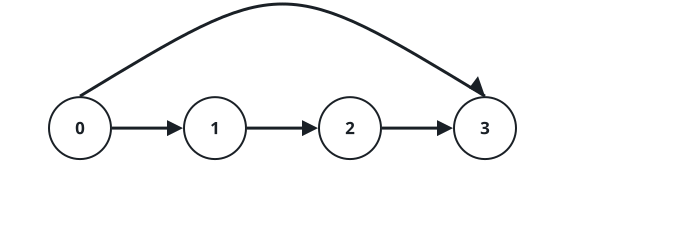

# Quickest Trip as Shortcuts Open II

## Description

The towns `0` through `n - 1` hang off a single one-way avenue: for every
`0 <= i < n - 1` a road leads straight from town `i` to town `i + 1`.

Shortcuts then start arriving. Each query `[u, v]` opens one additional
one-way road, from town `u` directly to town `v`, and every road opened
stays open. The shortcut list is well-behaved: no road appears twice, and
no two roads properly cross — there is never a pair of roads
`[u, v]` and `[x, y]` with `u < x < v < y`.

After each new road, a courier re-measures the smallest number of roads
that carries her from town `0` to town `n - 1`. Return an array `answer`
in which `answer[i]` is that smallest count once the first `i + 1` queries
have opened their roads.

### Example 1


```text
Input: n = 5, queries = [[2,4],[0,2],[0,4]]
Output: [3,2,1]
Explanation: The first shortcut drops the trip to 3 roads, the second to
2, and the direct 0-to-4 road finishes the job at 1.
```

### Example 2




```text
Input: n = 4, queries = [[0,3],[0,2]]
Output: [1,1]
Explanation: The very first shortcut already joins the two ends, so the
second road changes nothing.
```

### Example 3

```text
Input: n = 7, queries = [[2,5],[1,6]]
Output: [4,2]
Explanation: After the first shortcut the trip runs 0, 1, 2, 5, 6 — four
roads. The second lets the courier jump straight from 1 to 6, and town 6
is the destination, so two roads suffice.
```

### Constraints

- `3 <= n <= 10⁵`
- `1 <= queries.length <= 10⁵`
- `queries[i].length == 2`
- `0 <= queries[i][0] < queries[i][1] < n`
- `1 < queries[i][1] - queries[i][0]`
- No two queries open the same road.
- No two roads properly cross: there are no `i != j` with
  `queries[i][0] < queries[j][0] < queries[i][1] < queries[j][1]`.
