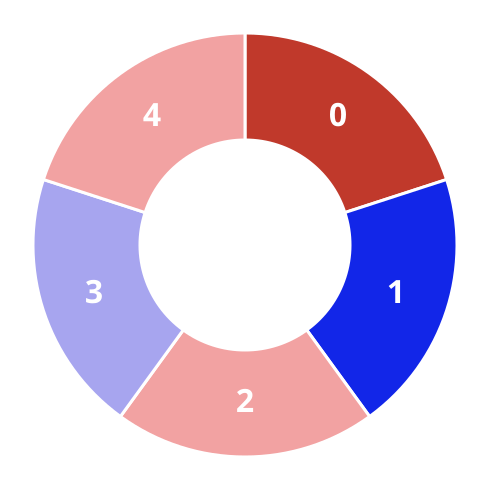
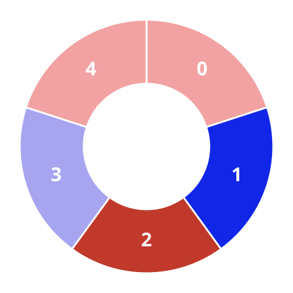
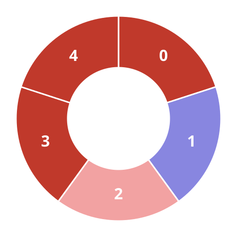
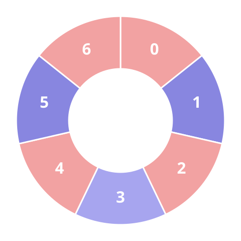
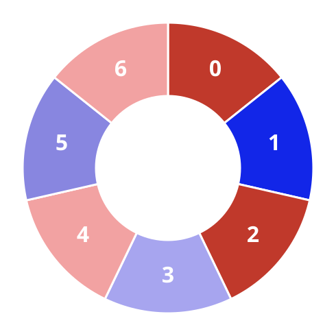
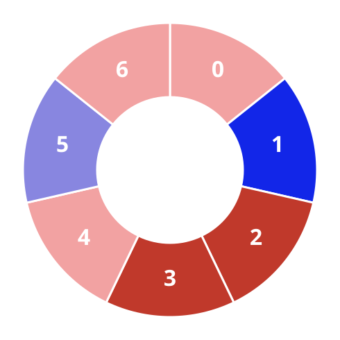

# Alternating Trios On A Circle III

## Description

Red and blue tiles are strung around a circle. Tile `i` wears color
`colors[i]`: `0` for red, `1` for blue. The circle closes on itself — the
last tile sits right next to the first.

An alternating group is any stretch of consecutive tiles along the circle
whose neighbors alternate: stepping through the stretch, each tile differs
in color from the one before it and from the one after it, counting the
wrap-around pair inside the stretch as neighbors.

A stream of queries arrives:

- `queries[i] = [1, size]` — report how many alternating groups of exactly
  `size` tiles the circle currently holds;
- `queries[i] = [2, index, color]` — repaint tile `index` to `color`.

Return an array collecting the answers of the counting queries, in the
order they were asked.

### Example 1








```text
Input: colors = [0,1,1,0,1], queries = [[2,1,0],[1,4]]
Output: [2]
Explanation: Tile 1 is repainted red first; afterwards exactly two
stretches of four consecutive tiles alternate around the circle.
```

### Example 2







```text
Input: colors = [0,0,1,0,1,1], queries = [[1,3],[2,3,0],[1,5]]
Output: [2,0]
Explanation: The circle starts with two alternating groups of size 3. The
repaint sets tile 3 to the color it already wears, so nothing moves, and
no stretch of five tiles ever alternates.
```

### Example 3

```text
Input: colors = [1,1,0,1,0,0], queries = [[1,4],[2,0,0],[1,3]]
Output: [1,3]
Explanation: At first the alternating run 1,0,1,0 across tiles 1-4 is the
only stretch of four, so the count is 1. Repainting tile 0 red turns the
circle into 0,1,0,1,0,0, whose five-tile alternating prefix hosts three
groups of size 3.
```

### Constraints

- `4 <= colors.length <= 5 * 10⁴`
- `0 <= colors[i] <= 1`
- `1 <= queries.length <= 5 * 10⁴`
- `queries[i][0]` is `1` or `2`.
- When `queries[i][0] == 1`: `queries[i].length == 2` and
  `3 <= queries[i][1] <= colors.length - 1`.
- When `queries[i][0] == 2`: `queries[i].length == 3`,
  `0 <= queries[i][1] <= colors.length - 1`, and
  `0 <= queries[i][2] <= 1`.

## Hints

### Hint 1

Store the maximal alternating stretches of the circle; a single repaint can
only disturb the two color changes adjacent to one tile, so updates stay
local.

### Hint 2

Keep the lengths of those maximal stretches in a structure that answers,
for a threshold, both how many stretches reach it and what their lengths
sum to.

### Hint 3

A maximal stretch of length `g` contains `g - size + 1` groups of exactly
`size` tiles when it is long enough, so those two aggregates over long
enough stretches produce every count.
