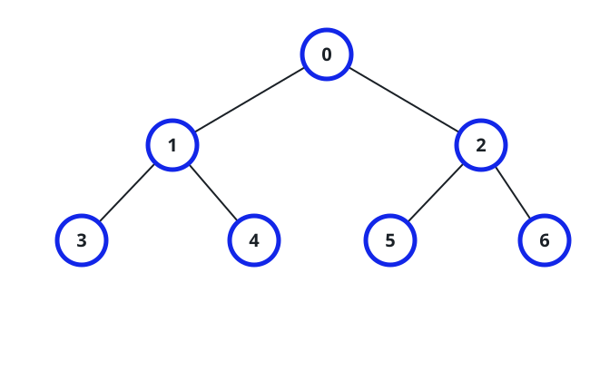
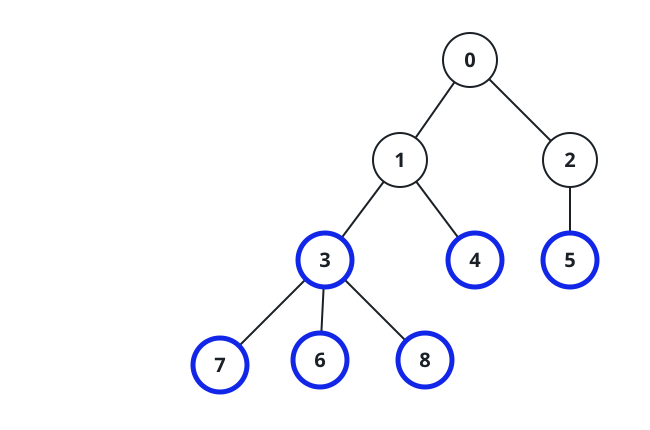
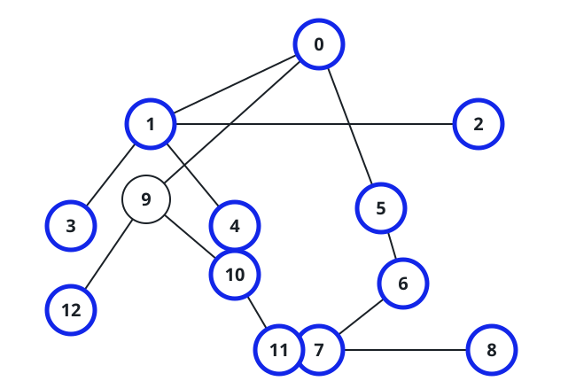

# Evenly Split Nodes

## Description

You are given an undirected tree with `n` nodes numbered `0` to `n - 1`,
rooted at node `0`, described by an array `edges` of `n - 1` pairs, where
`edges[i] = [ai, bi]` joins nodes `ai` and `bi`.

Call a node **evenly split** when all of its children root subtrees of
the same size. A leaf has no children, so it is evenly split by default.

Return how many nodes of the tree are evenly split.

(A subtree is some node together with every one of its descendants.)

### Example 1



```text
Input: edges = [[0,1],[0,2],[1,3],[1,4],[2,5],[2,6]]
Output: 7
Explanation: Every node passes: node 0 has two size-3 branches, nodes 1
and 2 each have two size-1 branches, and the four leaves qualify
automatically.
```

### Example 2



```text
Input: edges = [[0,1],[1,2],[2,3],[3,4],[0,5],[1,6],[2,7],[3,8]]
Output: 6
Explanation: Nodes 3, 4, 5, 6, 7, and 8 are evenly split. Node 2 is not —
its branches hold 3 and 1 nodes — and nodes 1 and 0 each fail the same
way.
```

### Example 3



```text
Input: edges = [[0,1],[1,2],[1,3],[1,4],[0,5],[5,6],[6,7],[7,8],[0,9],
[9,10],[9,12],[10,11]]
Output: 12
Explanation: Node 9 is the only node that fails — its branches hold 2
and 1 nodes — so the other 12 all count.
```

### Constraints

- `2 <= n <= 10⁵`
- `edges.length == n - 1`
- `edges[i].length == 2`
- `0 <= ai, bi < n`
- The given edges always form a valid tree.

## Hints

### Hint 1

A single traversal that returns each subtree's size to its parent is all
you need — a node's verdict falls out of comparing its children's sizes.
