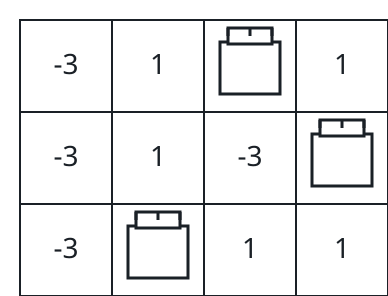

# Best Three-Rook Lineup I

## Description

You are given an `m x n` grid `board`, where `board[i][j]` is the value —
possibly negative — of the cell in row `i`, column `j`.

Rooks attack along their whole row and column, so three rooks coexist
peacefully only when no two of them share a row or a column. Choose cells
for three rooks that are pairwise peaceful in this sense.

Return the greatest possible sum of the three chosen cells' values.

### Example 1



```text
Input: board = [[-3,1,1,1],[-3,1,-3,1],[-3,2,1,1]]
Output: 4
Explanation: Cells (0, 2), (1, 3), and (2, 1) sit in three distinct rows
and columns, and 1 + 1 + 2 = 4 is the best any peaceful placement scores.
```

### Example 2

```text
Input: board = [[5,1,2],[1,9,3],[4,2,8]]
Output: 22
Explanation: The rooks take 5, 9, and 8 — one per row and one per column —
for 5 + 9 + 8 = 22.
```

### Example 3

```text
Input: board = [[-1,-5,-2],[-5,-1,-6],[-2,-6,-3]]
Output: -5
Explanation: Every cell is negative, so the placement simply limits the
damage: -1 + -1 + -3 = -5.
```

### Constraints

- `3 <= m == board.length <= 100`
- `3 <= n == board[i].length <= 100`
- `-10⁹ <= board[i][j] <= 10⁹`

## Hints

### Hint 1

Once three rows are fixed, the rooks must land in three different columns,
so entire columns of each chosen row are irrelevant — only its strongest
few cells can ever be picked.

### Hint 2

Keep the three most valuable cells of every row. Three candidate columns
cannot all be blocked by two rooks, so a rook standing anywhere else can
always slide into a free top-three cell of its row without losing value.

### Hint 3

Walk over all row triples and their candidates, and abandon any partial
combination whose most optimistic completion already fails to beat the
best sum found so far.
