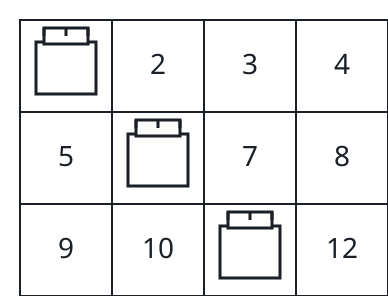

# Best Three-Rook Lineup II

## Description

You are given an `m x n` grid `board`, where `board[i][j]` is the value —
possibly negative — of the cell in row `i`, column `j`.

Place three rooks so that no two attack each other: rooks threaten along
their entire row and column, so the three chosen cells must use three
distinct rows and three distinct columns.

Return the greatest possible sum of the three chosen cells' values.

### Example 1



```text
Input: board = [[-3,1,1,1],[-3,1,-3,1],[-3,2,1,1]]
Output: 4
Explanation: Rooks on (0, 2), (1, 3), and (2, 1) avoid each other's rows
and columns, and 1 + 1 + 2 = 4 is the largest sum attainable.
```

### Example 2

```text
Input: board = [[2,7,1],[8,2,9],[3,6,4]]
Output: 19
Explanation: Taking 7, 9, and 3 puts one rook in each row and each column,
scoring 7 + 9 + 3 = 19.
```

### Example 3

```text
Input: board = [[-4,2,-1,3],[1,-2,4,-3],[2,3,-5,1],[-1,4,2,-2]]
Output: 11
Explanation: A peaceful placement can still mix positive cells across
distinct rows and columns to reach 11.
```

### Constraints

- `3 <= m == board.length <= 500`
- `3 <= n == board[i].length <= 500`
- `-10⁹ <= board[i][j] <= 10⁹`

## Hints

### Hint 1

Any placement splits across a highest rook, a lowest rook, and a middle
row in between — scoring only needs the best cell available above and
below that middle row in every column.

### Hint 2

Sweep the middle row while maintaining, for each column, the maximum value
above it and below it; then only the three strongest columns of each of
the three groups can ever be part of an optimum.

### Hint 3

With at most three candidates per group, enumerate the 27 column choices,
skipping any that repeat a column, and keep the best legal sum.
