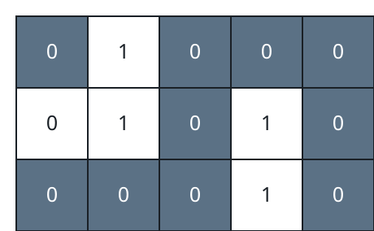
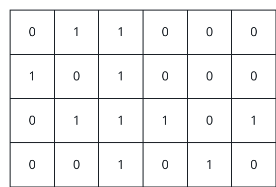
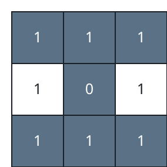

# Crossing The Grid With Health To Spare

## Description

You are handed a map in the form of an `m x n` binary matrix `grid`,
together with an integer `health` — your stock of health points.

The assignment is a corner-to-corner crossing: begin on the upper-left
cell `(0, 0)` and finish on the lower-right cell `(m - 1, n - 1)`. From
wherever you stand you may step to any side-adjacent cell — up, down,
left, or right.

Cells marked `1` are unsafe, and every time your route steps onto one,
your health drops by 1; the starting cell charges too. You may keep
moving only while your health remains positive, and the trip only
counts as survived if you arrive with at least 1.

Return `true` when some route reaches the far corner with health to
spare, and `false` otherwise.

### Example 1



```text
Input: grid = [[0,1,0,0,0],[0,1,0,1,0],[0,0,0,1,0]], health = 1
Output: true
Explanation: A single point leaves no room for spending, so the route
must never leave the safe cells — the gray path in the diagram threads
them from corner to corner.
```

### Example 2



```text
Input: grid = [[0,1,1,0,0,0],[1,0,1,0,0,0],[0,1,1,1,0,1],[0,0,1,0,1,0]], health = 3
Output: false
Explanation: Every corner-to-corner route here is forced onto at least
four unsafe cells, so three points cannot pay for the trip — the
crossing needs a stock of 4 or better.
```

### Example 3



```text
Input: grid = [[1,1,1],[1,0,1],[1,1,1]], health = 5
Output: true
Explanation: The gray route detours through the one safe cell at the
center, spending four points and arriving with the fifth unspent. Any
route that avoids the center walks on unsafe cells the entire way and
pays its fifth and last point at the very moment it steps onto the
goal — health 0 there is one short of survival.
```

### Constraints

- `m == grid.length`
- `n == grid[i].length`
- `1 <= m, n <= 50`
- `2 <= m * n`
- `1 <= health <= m + n`
- `grid[i][j]` is either `0` or `1`.

## Hints

### Hint 1

Price the steps: walking onto a `1` cell costs one point and walking
onto a `0` cell is free, so the question becomes whether the cheapest
corner-to-corner route stays within budget. That is a shortest-path
problem whose edge weights are only 0 and 1.
