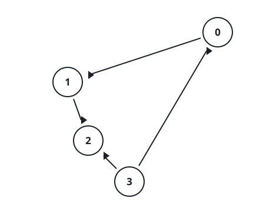
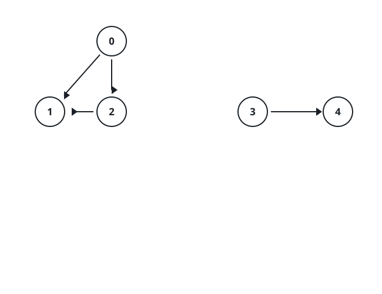
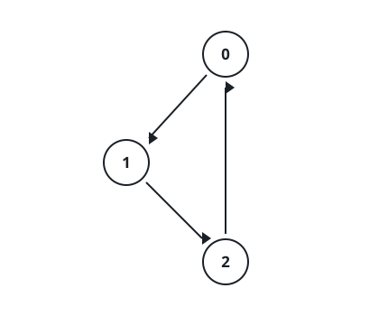

# Sweeping Out Suspect Methods

## Description

A project consists of `n` methods numbered `0` through `n - 1`, and you
know the call structure between them: each pair in `invocations` says that
its first method calls its second.

One method, number `k`, is known to carry a bug. It and everything it
reaches — through one call, a chain of calls, any number of hops — form
the suspect group, and the plan is to delete that whole group in one go.

The deletion is all-or-nothing: it may proceed only when no method outside
the group calls a method inside it. The moment even one such outside
caller exists, the project is left completely untouched.

Report which methods the project ends up with, sorted in ascending order.
(The original problem accepted the survivors in any order; this judge
compares the array exactly, so sort them — every answer the original
accepts is the same set.)

### Example 1



```text
Input: n = 4, k = 1, invocations = [[1,2],[0,1],[3,2]]
Output: [0,1,2,3]
Explanation: The bug in method 1 spreads to method 2, so methods 1 and 2
are suspect. But method 0 calls method 1 and method 3 calls method 2 —
outside callers exist, so nothing may be deleted and all four methods
survive.
```

### Example 2



```text
Input: n = 5, k = 0, invocations = [[1,2],[0,2],[0,1],[3,4]]
Output: [3,4]
Explanation: Methods 0, 1, and 2 form the suspect group, and nothing
outside it calls into it. They are removed; methods 3 and 4 remain.
```

### Example 3



```text
Input: n = 3, k = 2, invocations = [[1,2],[0,1],[2,0]]
Output: []
Explanation: Every method is reachable from method 2, so the entire
project is suspect and removable.
```

### Constraints

- `1 <= n <= 10⁵`
- `0 <= k <= n - 1`
- `0 <= invocations.length <= 2 * 10⁵`
- Each element of `invocations` is a pair `[a, b]` with
  `0 <= a, b <= n - 1` and `a != b`.
- No pair appears twice in `invocations`.

## Hints

### Hint 1

Follow the calls outward from method `k` once; that visits exactly the
suspect group.

### Hint 2

With the group marked, one pass over the edge list settles the
all-or-nothing rule: does any edge run from an unmarked method into a
marked one?
