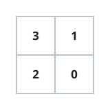
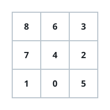

# Fitting A Graph Into A Grid

## Description

You get an undirected graph on `n` nodes described by `edges`, where each
`edges[i] = [u, v]` connects nodes `u` and `v`.

Arrange all `n` nodes into the cells of a rectangular grid so that the
drawing matches the wiring precisely:

- every node from `0` to `n - 1` occupies exactly one cell, and
- two nodes sit in side-adjacent cells (sharing a horizontal or vertical
  border) exactly when an edge joins them — no adjacency without an edge,
  and no edge without an adjacency.

The input is promised to admit such an arrangement. Return the grid as a
2D array whose rows are the grid's rows; if several arrangements work, any
of them is accepted.

### Example 1

```text
Input: n = 4, edges = [[0,1],[0,2],[1,3],[2,3]]
Output: [[3,1],[2,0]]
Explanation: The arrangement is:
3 1
2 0
```



### Example 2

```text
Input: n = 5, edges = [[0,1],[1,3],[2,3],[2,4]]
Output: [[4,2,3,1,0]]
Explanation: The arrangement is a single row:
4 2 3 1 0
```


### Example 3

```text
Input: n = 9, edges = [[0,1],[0,4],[0,5],[1,7],[2,3],[2,4],[2,5],[3,6],[4,6],[4,7],[6,8],[7,8]]
Output: [[8,6,3],[7,4,2],[1,0,5]]
Explanation: The arrangement is:
8 6 3
7 4 2
1 0 5
```



### Constraints

- `2 <= n <= 5 * 10⁴`
- `1 <= edges.length <= 10⁵`
- Each edge is a pair `[u, v]` with `0 <= u < v < n`.
- All edges are distinct.
- The graph is guaranteed to be arrangeable as described.

## Hints

### Hint 1

Count how many neighbors each node has — the degree profile alone tells
you the grid's shape.

### Hint 2

When exactly two nodes have degree 1 and everyone else has degree 2, the
graph is one long path: a one-row (or one-column) layout, which can be
peeled off as its own case.

### Hint 3

Otherwise the lowest-degree nodes are precisely the grid's corners.

### Hint 4

Starting from a corner and its two neighbors, the rest of the grid can be
grown row by row, testing at each step which unplaced node is the one that
touches the right earlier cells.
