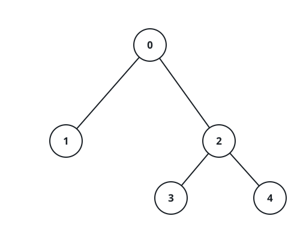

# The Marking Wave's Stragglers

## Description

An undirected tree has `n` nodes numbered `0` through `n - 1`; its
`n - 1` connections are listed in `edges`, where `edges[i] = [u, v]` joins
nodes `u` and `v`.

Every node starts unmarked. Then the marking spreads in waves: at the end
of each second, every still-unmarked node with at least one marked
neighbor becomes marked too.

For each node `i`, imagine kicking the process off by marking only `i` at
time zero. Report `nodes[i]`: some node that gets marked last under that
scenario. When several nodes tie for last, any one of them is acceptable.

### Example 1


```text
Input: edges = [[0,1],[0,2]]
Output: [2,2,1]
Explanation:
Starting from 0, the wave runs [0] -> [0,1,2]; nodes 1 and 2 tie for last.
Starting from 1, it runs [1] -> [0,1] -> [0,1,2]; node 2 is last.
Starting from 2, it runs [2] -> [0,2] -> [0,1,2]; node 1 is last.
```

### Example 2


```text
Input: edges = [[0,1]]
Output: [1,0]
Explanation:
Starting from 0 the run is [0] -> [0,1]; starting from 1 it is
[1] -> [0,1]. Each start's straggler is the other node.
```

### Example 3



```text
Input: edges = [[0,1],[0,2],[2,3],[2,4]]
Output: [3,3,1,1,1]
Explanation:
Starting from 0: [0] -> [0,1,2] -> [0,1,2,3,4].
Starting from 1: [1] -> [0,1] -> [0,1,2] -> [0,1,2,3,4].
Starting from 2: [2] -> [0,2,3,4] -> [0,1,2,3,4].
Starting from 3: [3] -> [2,3] -> [0,2,3,4] -> [0,1,2,3,4].
Starting from 4: [4] -> [2,4] -> [0,2,3,4] -> [0,1,2,3,4].
```

### Constraints

- `2 <= n <= 10⁵`
- `edges.length == n - 1`
- Each element of `edges` is a pair of node numbers between `0` and
  `n - 1`.
- The connections are guaranteed to form a valid tree.

## Hints

### Hint 1

The wave front advances one BFS layer per second, so the straggler for a
start `i` is just a farthest node from `i` — the question is really about
tree eccentricity.

### Hint 2

Two sweeps from an arbitrary start surface the two ends of a diameter.

### Hint 3

For every node, some diameter endpoint is among its farthest nodes.

### Hint 4

So two distance arrays — one from each diameter end — answer every start
at once: pick whichever endpoint is farther.
