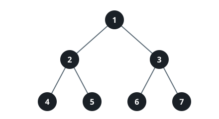

# Sizing Up Perfect Subtrees

## Description

The root of a binary tree arrives together with an integer k.

Report the node count of the k-th largest perfect binary subtree inside the
tree, using -1 when no such subtree exists to name.

A binary tree is perfect when every parent raises exactly two children and
all the leaves line up on one level.

### Example 1


```text
Input: root = [5,3,6,5,2,5,7,1,8,null,null,6,8], k = 2
Output: 3
Explanation: The roots of the perfect subtrees are highlighted in black.
Their sizes, largest first, run [3, 3, 1, 1, 1, 1, 1, 1] — the 2nd of
those is 3.
```

### Example 2



```text
Input: root = [1,2,3,4,5,6,7], k = 1
Output: 7
Explanation: The perfect subtrees measure, largest first,
[7, 3, 3, 1, 1, 1, 1] — the biggest one holds all 7 nodes.
```

### Example 3


```text
Input: root = [1,2,3,null,4], k = 3
Output: -1
Explanation: Only two perfect subtrees exist here, both of size 1, so a
third place on the list never materializes.
```

### Constraints

- The tree carries between 1 and 2000 nodes.
- `1 <= Node.val <= 2000`
- `1 <= k <= 1024`

## Hints

### Hint 1

Perfection is hereditary: a subtree can only be perfect when both of the
subtrees below it already are.

### Hint 2

Settle every node bottom-up — a leaf is perfect at size 1, and an internal
node becomes perfect exactly when its two children are perfect and equal
in size.

### Hint 3

Collect the sizes of all the perfect subtrees you found and hand back the
k-th largest, falling back to -1 when the list is too short.
