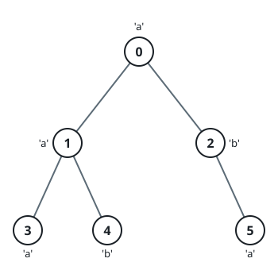
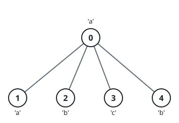

# Palindromic Subtree Strings

## Description

You get a tree whose root is node 0 and whose n nodes are numbered 0
through n - 1. The tree arrives as an array parent of length n, where
parent[i] is node i's parent (parent[0] == -1 because node 0 has no
parent). Alongside it you get a string s of length n; the letter s[i]
belongs to node i.

Imagine a shared string dfsStr, initially empty, and a recursive
procedure dfs(x) that does two things in order:

1. For every child y of x, taken in increasing order of node number,
   run dfs(y).
2. Append the letter s[x] to the end of dfsStr.

The string dfsStr is shared by every recursive call, so each invocation
leaves the characters of x's whole subtree, in visit order, sitting in
dfsStr.

Build a boolean array answer of length n as follows. For each node i:

1. Clear dfsStr, then run dfs(i).
2. Set answer[i] to true if the string now stored in dfsStr reads the
   same forwards and backwards, and to false otherwise.

Return answer.

### Example 1



```text
Input: parent = [-1,0,0,1,1,2], s = "aababa"
Output: [true,true,false,true,true,true]
Explanation:
- dfs(0) builds dfsStr = "abaaba", a palindrome.
- dfs(1) builds dfsStr = "aba", a palindrome.
- dfs(2) builds dfsStr = "ab", which is not a palindrome.
- dfs(3) builds dfsStr = "a", a palindrome.
- dfs(4) builds dfsStr = "b", a palindrome.
- dfs(5) builds dfsStr = "a", a palindrome.
```

### Example 2



```text
Input: parent = [-1,0,0,0,0], s = "aabcb"
Output: [true,true,true,true,true]
Explanation: Here every node's call produces a palindrome.
```

### Constraints

- `n == parent.length == s.length`
- `1 <= n <= 10⁵`
- `0 <= parent[i] <= n - 1 for every i >= 1.`
- `parent[0] == -1`
- `parent describes a valid tree.`
- `s contains only lowercase English letters.`

## Hints

### Hint 1

Run the traversal a single time starting at the root, writing each node
into an array in the order it appends its letter.

### Hint 2

Whatever node you start from, its subtree's letters always land on one
contiguous stretch of that recorded sequence.

### Hint 3

Manacher's algorithm then settles each node's palindrome question in
constant time.
