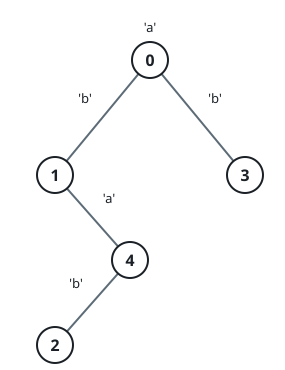

# Subtree Sizes After The Rewire

## Description

A tree is rooted at node 0 and holds n nodes numbered 0 through n - 1.
It reaches you as an array parent of length n — parent[i] names node
i's parent, and parent[0] == -1 marks the root. A string s of the same
length labels the nodes: node i carries the letter s[i].

Every node x from 1 to n - 1 now gets rewired, all at once:

1. Look for the nearest ancestor y of x whose letter matches — the
   closest node with s[y] == s[x] on the path from x up to the root.
2. If no such y exists, x stays put.
3. Otherwise, detach x from its current parent and hang it under y
   instead.

After this one round of rewiring, report an array answer of length n
where answer[i] counts the nodes in the subtree rooted at i.

### Example 1


```text
Input: parent = [-1,0,0,1,1,1], s = "abaabc"
Output: [6,3,1,1,1,1]
Explanation: Node 3 is the only mover: its new parent becomes node 0.
```

### Example 2



```text
Input: parent = [-1,0,4,0,1], s = "abbba"
Output: [5,2,1,1,1]
Explanation:
- Node 4 moves from node 1 to node 0.
- Node 2 moves from node 4 to node 1.
```

### Constraints

- `n == parent.length == s.length`
- `1 <= n <= 10⁵`
- `0 <= parent[i] <= n - 1 for every i >= 1.`
- `parent[0] == -1`
- `parent forms a valid tree.`
- `s is made of lowercase English letters only.`

## Hints

### Hint 1

A depth-first search from the root reaches every node in ancestry
order.

### Hint 2

While that search descends, remember the latest node visited for each
of the 26 letters — those are exactly the candidate new parents.
