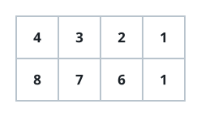

# Counting Tidy Submatrices

## Description

You are given an `m x n` integer matrix `grid` and a non-negative integer
`k`. Count the submatrices of `grid` that meet both of these conditions:

- No cell inside the submatrix exceeds `k`.
- Every row it covers is in non-increasing order across the chosen
  columns.

A submatrix `(x1, y1, x2, y2)` consists of all cells `grid[x][y]` with
`x1 <= x <= x2` and `y1 <= y <= y2`.

### Example 1



```text
Input: grid = [[4,3,2,1],[8,7,6,1]], k = 3
Output: 8
Explanation: Cells above `3` are out of play. Row 0's tail `[3,2,1]`
yields six one-row submatrices — every contiguous slice of it — and row
1 contributes only its final `[1]`. Stacking the two trailing 1s adds
`[[1],[1]]`. Eight in all.
```

### Example 2

```text
Input: grid = [[3,1],[2,4]], k = 4
Output: 7
Explanation: Every cell is at most `4`. All four single cells qualify, as
does the top row's `[3,1]`; the bottom row climbs `2` then `4`, so its
wide pick fails. The two single-column stacks `[[3],[2]]` and `[[1],[4]]`
qualify, while the full 2x2 does not. That makes `7`.
```

### Example 3

```text
Input: grid = [[2]], k = 1
Output: 0
Explanation: The only candidate is `[[2]]`, and its single cell exceeds
`k = 1`, so nothing qualifies.
```

### Constraints

- `1 <= m == grid.length <= 10³`
- `1 <= n == grid[i].length <= 10³`
- `1 <= grid[i][j] <= 10⁹`
- `1 <= k <= 10⁹`

## Hints

### Hint 1

Work one row at a time: a submatrix is valid exactly when all of its rows
are, so for each cell compute the length of the longest non-increasing,
within-`k` run of its row that ends at that cell.

### Hint 2

Counting by bottom-right corner turns the question into a sum of those
run-length minima down each column — exactly the pattern a monotonic
stack settles in one sweep.
