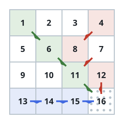

# Gathering From Three Corners

## Description

An orchard is laid out as an `n x n` grid of plots, and `fruits[i][j]`
is the amount of fruit waiting in plot `(i, j)`. Three pickers start at
the corner plots `(0, 0)`, `(0, n - 1)`, and `(n - 1, 0)`, and each must
reach the far corner `(n - 1, n - 1)` in exactly `n - 1` moves:

- the picker at `(0, 0)` steps to `(i + 1, j + 1)`, `(i + 1, j)`, or
  `(i, j + 1)`;
- the picker at `(0, n - 1)` steps to `(i + 1, j - 1)`, `(i + 1, j)`, or
  `(i + 1, j + 1)`;
- the picker at `(n - 1, 0)` steps to `(i - 1, j + 1)`, `(i, j + 1)`, or
  `(i + 1, j + 1)`.

A move is legal only when the destination plot exists.

Entering a plot gathers its fruit. A plot pays out once: if several
pickers visit the same plot, only one of them picks anything up.

Return the largest total harvest the three pickers can achieve.

### Example 1



```text
Input: fruits = [[1,2,3,4],[5,6,8,7],[9,10,11,12],[13,14,15,16]]
Output: 100
Explanation: The picker from (0,0) walks the main diagonal (0,0) ->
(1,1) -> (2,2) -> (3,3) for 1 + 6 + 11 + 16. The picker from (0,3)
descends (0,3) -> (1,2) -> (2,3) -> (3,3) for 4 + 8 + 12, and the
picker from (3,0) runs along the bottom row (3,0) -> (3,1) -> (3,2) ->
(3,3) for 13 + 14 + 15. The shared final plot pays out once, so the
total is 1 + 6 + 11 + 16 + 4 + 8 + 12 + 13 + 14 + 15 = 100.
```

### Example 2

```text
Input: fruits = [[4,7,2],[9,1,8],[5,3,6]]
Output: 29
Explanation: The diagonal walk collects 4 + 1 + 6 = 11. The picker from
the top-right corner steps straight down for 2 + 8 = 10, and the picker
from the bottom-left corner walks along the bottom row for 5 + 3 = 8.
Together that is 29.
```

### Example 3

```text
Input: fruits = [[2,9,4,8],[6,1,3,7],[5,0,2,9],[8,4,1,6]]
Output: 48
Explanation: The diagonal contributes 2 + 1 + 2 + 6 = 11. The top-right
picker collects 8 + 7 + 9 = 24 down the last column, while the
bottom-left picker collects 8 + 4 + 1 = 13 along the bottom row, for a
total of 48.
```

### Constraints

- `2 <= n == fruits.length == fruits[i].length <= 1000`
- `0 <= fruits[i][j] <= 1000`

## Hints

### Hint 1

One picker is on rails: to get from `(0, 0)` to the far corner in
exactly `n - 1` moves, every single move must advance both coordinates
at once, so the main diagonal is the only route.

### Hint 2

The other two pickers cannot afford a visit to that diagonal — crossing
onto it strands them too far from their own corner — so all three
routes can be planned independently.

### Hint 3

Plan each side picker with dynamic programming, one row at a time and
three predecessor cells at a time.
