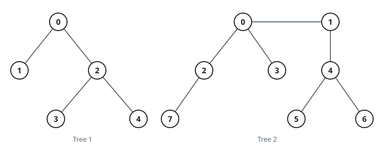
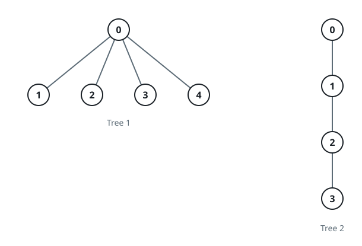

# Bridging Trees To Count Kin I

## Description

Two undirected trees are on the table. The first has `n` nodes labeled
`0` through `n - 1`; the second has `m` nodes labeled `0` through
`m - 1`. Their edge sets arrive as the 2D arrays `edges1` (length
`n - 1`, with `edges1[i] = [ai, bi]` joining `ai` and `bi` in the first
tree) and `edges2` (length `m - 1`, with `edges2[i] = [ui, vi]` joining
`ui` and `vi` in the second tree). An integer `k` comes with them.

Node `u` is kin to node `v` when the path between them crosses at most
`k` edges. Every node is kin to itself.

For each node `i` of the first tree you get to add one bridge — a single
edge from some node of the first tree to some node of the second tree —
and then count how many nodes are kin to `i` across the merged graph.
Choose the bridge that makes that count as large as possible. Scenarios
are judged one at a time: take the bridge back down before weighing the
next one.

Return an array `answer` of `n` integers where `answer[i]` is that
largest possible kin count for node `i`.

### Example 1



```text
Input: edges1 = [[0,1],[0,2],[2,3],[2,4]], edges2 = [[0,1],[0,2],[0,3],[2,7],[1,4],[4,5],[4,6]], k = 2
Output: [9,7,9,8,8]
Explanation: For i = 0 the best bridge runs from node 0 of the first
tree to node 0 of the second tree; for i = 1 it runs from node 1 to
node 0; for i = 2 from node 2 to node 4; for i = 3 from node 3 to
node 4; and for i = 4 from node 4 to node 4.
```

### Example 2



```text
Input: edges1 = [[0,1],[0,2],[0,3],[0,4]], edges2 = [[0,1],[1,2],[2,3]], k = 1
Output: [6,3,3,3,3]
Explanation: With only one step of reach, every node i of the first tree
is best served by bridging to any node of the second tree at all — one
new kin plus itself.
```

### Constraints

- `2 <= n, m <= 1000`
- `edges1.length == n - 1`
- `edges2.length == m - 1`
- `edges1[i].length == edges2[i].length == 2`
- `edges1[i] = [ai, bi]`
- `0 <= ai, bi < n`
- `edges2[i] = [ui, vi]`
- `0 <= ui, vi < m`
- The input is generated such that edges1 and edges2 represent valid trees.
- `0 <= k <= 1000`

## Hints

### Hint 1

Inside its own tree, a node's kin set never changes: it is the count of
nodes within distance `k` of it.

### Hint 2

Everything a bridge adds must sit within distance `k - 1` of the chosen
second-tree endpoint — and the endpoint that maximizes that count is the
same one for every first-tree node, so find it once.
