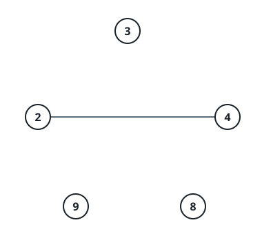

# Groups Under The LCM Ceiling

## Description

You are handed an array `nums` of distinct positive integers and a cap
`threshold`. Picture one dot per value. Dots `i` and `j` are joined by
an undirected line exactly when `lcm(nums[i], nums[j]) <= threshold`,
where `lcm(a, b)` denotes the least common multiple of `a` and `b`.

Report how many separate pieces the dots fall into: a piece is a
maximal group of dots that can reach one another by walking joined
lines, and no line leaves the group.

### Example 1



```text
Input: nums = [2,4,8,3,9], threshold = 5
Output: 4
Explanation: `2` and `4` link up because lcm(2, 4) = 4 fits under the
cap. Nothing else pairs with anything — lcm(3, 9) = 9, lcm(2, 8) = 8 —
so the pieces are (2, 4), (3), (8), (9).
```

### Example 2


```text
Input: nums = [2,4,8,3,9,12], threshold = 10
Output: 2
Explanation: With more headroom the first five values chain into one
piece — `3` bridges to `2` (lcm 6) and to `9` (lcm 9). Every lcm that
involves `12` is at least `12`, so it stays alone: (2, 3, 4, 8, 9) and
(12).
```

### Constraints

- `1 <= nums.length <= 10⁵`
- `1 <= nums[i] <= 10⁹`
- `1 <= threshold <= 2 * 10⁵`
- All values in `nums` are distinct.

## Hints

### Hint 1

A union-find reduces the answer to counting live roots; the real work
is surfacing the edges without testing every pair.

### Hint 2

Sweep the present values in ascending order, remembering for each
multiple `m <= threshold` the first present divisor that claimed it.
Any later divisor of `m` can union with that anchor, because both
endpoints divide `m`, so their lcm divides `m` and stays under the cap.
