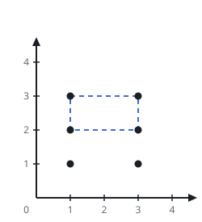

# The Largest Empty Corner Rectangle I

## Description

You are given an array `points`, where `points[i] = [xi, yi]` places a
point on an endless plane.

Hunt for the largest rectangle that satisfies all of these at once:

- Its four corners are four of the given points.
- Its sides run parallel to the axes.
- No other given point falls inside it or on its boundary.

Return that largest area, or `-1` when no rectangle qualifies.

### Example 1


```text
Input: points = [[1,1],[1,3],[3,1],[3,3]]
Output: 4
Explanation: The four points are the corners of a rectangle, and no
fifth point exists to spoil it, so the best area is 2 x 2 = 4.
```

### Example 2


```text
Input: points = [[1,1],[1,3],[3,1],[3,3],[2,2]]
Output: -1
Explanation: The only four-corner rectangle here is the same 2 x 2 one,
but `[2,2]` sits dead inside it, so no rectangle qualifies.
```

### Example 3



```text
Input: points = [[1,1],[1,3],[3,1],[3,3],[1,2],[3,2]]
Output: 2
Explanation: The points [1,3], [1,2], [3,2], [3,3] outline a 1 x 2
rectangle that stays empty. The strip [1,1], [1,2], [3,1], [3,2] is
equally good, but the full 2 x 2 frame is blocked by the midpoints.
```

### Constraints

- `1 <= points.length <= 10`
- `points[i].length == 2`
- `0 <= xi, yi <= 100`
- All the given points are distinct.

## Hints

### Hint 1

Given opposite corners `(x1, y1)` and `(x2, y2)`, the remaining corners
are forced: `(x1, y2)` and `(x2, y1)`.

### Hint 2

Fix two of the four corners and look up the other two in a set.

### Hint 3

For each surviving candidate rectangle, sweep the remaining points to
confirm none lies in its interior or along its edge.
