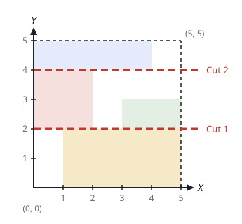
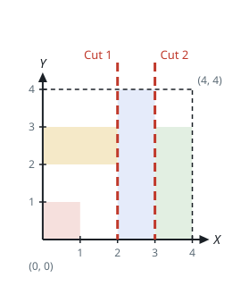

# Three Strips From Two Cuts

## Description

You are given an integer `n` — the side of an `n x n` board whose origin
sits at the board's bottom-left corner — and a 2D array `rectangles`,
where `rectangles[i] = [startx, starty, endx, endy]` places one
rectangle on the board:

- `(startx, starty)` is the rectangle's bottom-left corner.
- `(endx, endy)` is its top-right corner.

The rectangles never overlap one another. Can you slice the board with
either two horizontal cuts or two vertical cuts so that:

- each of the three pieces the cuts produce holds at least one
  rectangle, and
- every rectangle lands wholly inside exactly one piece?

Return `true` when such a pair of cuts exists, and `false` otherwise.

### Example 1



```text
Input: n = 5, rectangles = [[1,0,5,2],[0,2,2,4],[3,2,5,3],[0,4,4,5]]
Output: true
Explanation: The board is drawn in the diagram. Two horizontal cuts,
at y = 2 and y = 4, carve it into three strips that each catch a
rectangle.
```

### Example 2



```text
Input: n = 4, rectangles = [[0,0,1,1],[2,0,3,4],[0,2,2,3],[3,0,4,3]]
Output: true
Explanation: Here two vertical cuts, at x = 2 and x = 3, do the job.
```

### Example 3

```text
Input: n = 4, rectangles = [[0,0,2,2],[2,0,4,2],[0,2,4,4]]
Output: false
Explanation: The full-width rectangle along the top blocks every
vertical cut, and horizontally the layout offers a single gap — at
y = 2 — so a second cut never fits.
```

### Constraints

- `3 <= n <= 10⁹`
- `3 <= rectangles.length <= 10⁵`
- `0 <= rectangles[i][0] < rectangles[i][2] <= n`
- `0 <= rectangles[i][1] < rectangles[i][3] <= n`
- No two rectangles overlap.

## Hints

### Hint 1

Work one axis at a time: each rectangle contributes the interval
`[startx, endx]` along x and the interval `[starty, endy]` along y.

### Hint 2

Two cuts work along an axis exactly when that axis's intervals split
into three or more clusters — sort the intervals and count the gaps
between them.
