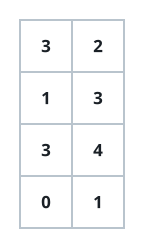
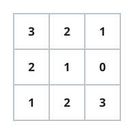

# Lifting Columns Into Strict Order

## Description

You are given an `m x n` grid `grid` of non-negative integers.

One operation chooses any single cell `grid[i][j]` and raises it by `1`.

A column reads as tidy when its values grow strictly from the top row
down to the bottom row. Return the fewest operations that leave every
column of `grid` strictly increasing.

### Example 1



```text
Input: grid = [[3,2],[1,3],[3,4],[0,1]]
Output: 15
Explanation: In column 0, lifting grid[1][0] by 3, grid[2][0] by 2, and
grid[3][0] by 6 turns it into [3,4,5,6]. In column 1, four lifts on
grid[3][1] turn it into [2,3,4,5]. Both columns are then strictly
increasing, and no schedule of lifts uses fewer than 15 operations.
```

### Example 2



```text
Input: grid = [[3,2,1],[2,1,0],[1,2,3]]
Output: 12
Explanation: Column 0 needs lifts of 2 and 4 on its lower two cells,
column 1 needs lifts of 2 and 2, and column 2 needs a lift of 2 on
grid[1][2]. Twelve operations in total leave every column strictly
increasing.
```

### Constraints

- `m == grid.length`
- `n == grid[i].length`
- `1 <= m, n <= 50`
- `0 <= grid[i][j] < 2500`

## Hints

### Hint 1

Whatever else happens, the cell below can never stay at or dip under the
cell above: `grid[i + 1][j]` must finish at least `grid[i][j] + 1`.

### Hint 2

Walk the rows from top to bottom, and give each cell the least allowed
finish — `max(grid[i][j], grid[i - 1][j] + 1)` — counting the lifts it
took.
