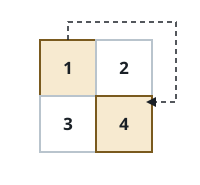
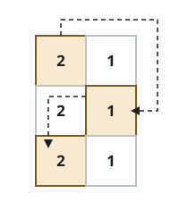
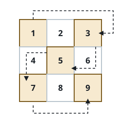

# The Skipping Serpentine Sweep

## Description

You are given an `m x n` grid of positive integers.

Walk the grid like a snake and keep only every second cell you step on.
The walk is fixed: begin at the top-left cell `(0, 0)`, cross the first
row left to right, drop to the next row and cross it right to left, and
keep alternating direction row after row until the bottom row is done.

Along that walk, take the first cell, skip the second, take the third,
and so on — the take/skip alternation carries on without resetting when
the walk drops to a new row.

Return the values of the taken cells, in the order the walk visits them.

### Example 1



```text
Input: grid = [[1,2],[3,4]]
Output: [1,4]
```

### Example 2



```text
Input: grid = [[2,1],[2,1],[2,1]]
Output: [2,1,2]
```

### Example 3



```text
Input: grid = [[1,2,3],[4,5,6],[7,8,9]]
Output: [1,3,5,7,9]
```

### Constraints

- `2 <= n == grid.length <= 50`
- `2 <= m == grid[i].length <= 50`
- `1 <= grid[i][j] <= 2500`

## Hints

### Hint 1

Even rows read left to right and odd rows read right to left, so the row
index alone decides each row's direction — no coordinates required.

### Hint 2

Keep one boolean toggle for take versus skip and flip it at every cell of
the walk, including across row boundaries; appending on "take" builds the
answer in a single pass.
