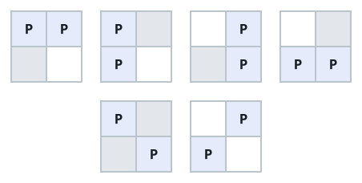

# How Far Apart The Pieces Sit

## Description

You are given three integers `m`, `n`, and `k`.

Consider an `m × n` grid holding `k` identical pieces, with at most one
piece per cell — every such placement is a valid arrangement. For a single
arrangement, measure the Manhattan distance between each pair of pieces and
add the distances up. Over all valid arrangements, return the total of
those per-arrangement sums, modulo 10⁹ + 7.

The Manhattan Distance between two cells (xi, yi) and (xj, yj) is
|xi - xj| + |yi - yj|.

### Example 1




```text
Input: m = 2, n = 2, k = 2
Output: 8
Explanation: The 2×2 board admits six placements of the two pieces. Four
of them seat the pieces on neighboring cells, where the distance between
them is 1; the other two seat them on opposite corners, where it is 2.
The grand total is therefore 1 + 1 + 1 + 1 + 2 + 2 = 8.
```

### Example 2


```text
Input: m = 1, n = 4, k = 3
Output: 20
Explanation: All three pieces share one row of four cells, so there are
four placements. The two compact ones — three consecutive cells at either
end — each contribute 1 + 1 + 2 = 4, while the two stretched ones each
contribute 1 + 2 + 3 = 6. In total 4 + 6 + 6 + 4 = 20.
```

### Constraints

- `1 <= m, n <= 10⁵`
- `2 <= m * n <= 10⁵`
- `2 <= k <= m * n`

## Hints

### Hint 1

Do not enumerate arrangements — enumerate pairs of cells instead, and for
a fixed pair ask how many arrangements occupy both cells at once.

### Hint 2

Every particular pair of cells carries pieces together in exactly
C(m * n - 2, k - 2) arrangements. Sum the pairwise distances over all cell
pairs of the empty board and scale by that factor.
