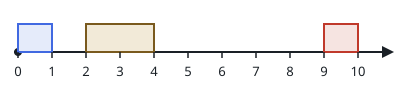

# Carving Out The Longest Break

## Description

An event runs on a timeline from `t = 0` to `t = eventTime`. Inside it are
`n` non-overlapping meetings: meeting `i` occupies the interval
`[startTime[i], endTime[i]]`, and the meetings appear in a fixed order that
never changes.

You may choose at most `k` meetings and slide each one to a different spot
on the timeline, keeping its duration and staying inside the event. After
the slides the order must still hold and no two meetings may overlap. You
want one continuous stretch of timeline with no meeting in it to be as long
as possible.

Return the length of the longest such stretch that any legal set of slides
can create.

### Example 1


```text
Input: eventTime = 5, k = 1, startTime = [1,3], endTime = [2,5]
Output: 2
Explanation: Sliding the meeting that runs [1, 2] over to [2, 3] empties
the stretch [0, 2], and a single slide cannot open anything longer.
```

### Example 2



```text
Input: eventTime = 10, k = 1, startTime = [0,2,9], endTime = [1,4,10]
Output: 6
Explanation: Sliding the meeting [2, 4] to [1, 3] clears every moment from
t = 3 to t = 9, a single break of length 6.
```

### Example 3

```text
Input: eventTime = 9, k = 2, startTime = [1,3,6], endTime = [2,4,7]
Output: 5
Explanation: Sliding the meetings [3, 4] and [6, 7] to the end of the
event as [7, 8] and [8, 9] leaves nothing scheduled between t = 2 and
t = 7, and no two slides can do better.
```

### Constraints

- `1 <= eventTime <= 10⁹`
- `n == startTime.length == endTime.length`
- `2 <= n <= 10⁵`
- `1 <= k <= n`
- `0 <= startTime[i] < endTime[i] <= eventTime`
- `endTime[i] <= startTime[i + 1]` for every `i` in `[0, n - 2]`

## Hints

### Hint 1

Split the timeline into `n + 1` meeting-free gaps: one before the first
meeting, one after the last, and one between each neighboring pair. A
single long break can only swallow gaps whose separating meetings all move.

### Hint 2

Moving at most `k` meetings merges at most `k + 1` consecutive gaps, so
slide a window of that fixed width across the gap list and keep the largest
total you see.
