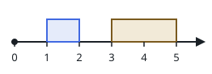
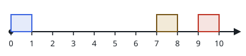
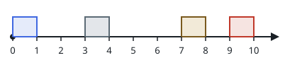

# Carving Out The Longest Break II

## Description

An event runs on a timeline from `t = 0` to `t = eventTime`. Inside it are
`n` non-overlapping meetings: meeting `i` occupies the interval
`[startTime[i], endTime[i]]`.

You may move a single meeting — at most one — to a different spot on the
timeline, keeping its duration and staying inside the event, provided the
meetings remain non-overlapping afterwards. Unlike the first version of
this task, the meeting you move does not have to keep its position in the
order; it may land anywhere a legal slot fits.

Return the length of the longest continuous meeting-free stretch that this
one move can create.

### Example 1



```text
Input: eventTime = 5, startTime = [1,3], endTime = [2,5]
Output: 2
Explanation: Sliding the meeting that runs [1, 2] over to [2, 3] empties
the stretch [0, 2], and no single move opens anything longer.
```

### Example 2



```text
Input: eventTime = 10, startTime = [0,7,9], endTime = [1,8,10]
Output: 7
Explanation: Relocating the meeting [0, 1] into the hour before t = 10
leaves nothing scheduled from t = 0 to t = 7.
```

### Example 3



```text
Input: eventTime = 10, startTime = [0,3,7,9], endTime = [1,4,8,10]
Output: 6
Explanation: Relocating the meeting [3, 4] next to the meeting [9, 10]
leaves nothing scheduled from t = 1 to t = 7.
```

### Example 4

```text
Input: eventTime = 8, startTime = [2,6], endTime = [3,7]
Output: 6
Explanation: The meeting [2, 3] fits exactly into the free hour before
t = 8, so moving it there empties the stretch [0, 6].
```

### Constraints

- `1 <= eventTime <= 10⁹`
- `n == startTime.length == endTime.length`
- `2 <= n <= 10⁵`
- `0 <= startTime[i] < endTime[i] <= eventTime`
- `endTime[i] <= startTime[i + 1]` for every `i` in `[0, n - 2]`

## Hints

### Hint 1

Moving a meeting somewhere far away only pays off if some gap elsewhere on
the timeline is at least as long as the meeting's duration; deleting the
meeting merges the two gaps around it either way.

### Hint 2

Precompute running maxima of the gap array from the left and from the right;
together they answer, for any meeting, the largest gap that does not touch
it, in constant time.
