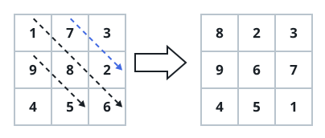
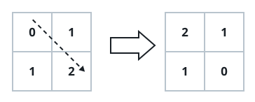

# Each Diagonal In Its Own Order

## Description

You are given an `n x n` matrix `grid` of integers. Rearrange the values
along each of its diagonals, then return the matrix:

- Every diagonal in the bottom-left triangle — the main diagonal included —
  must read in non-increasing order from top-left to bottom-right.
- Every diagonal strictly above the main diagonal (the top-right triangle)
  must read in non-decreasing order.

Values may only move within their own diagonal; nothing crosses from one
diagonal to another.

### Example 1



```text
Input: grid = [[1,7,3],[9,8,2],[4,5,6]]
Output: [[8,2,3],[9,6,7],[4,5,1]]
Explanation: The diagonals with a black arrow (bottom-left triangle) end up
in non-increasing order:

[1, 8, 6] becomes [8, 6, 1].

[9, 5] and [4] are already in that order.

The diagonals with a blue arrow (top-right triangle) end up in
non-decreasing order:

[7, 2] becomes [2, 7].

[3] is a single cell, so nothing changes.
```

### Example 2



```text
Input: grid = [[0,1],[1,2]]
Output: [[2,1],[1,0]]
Explanation: On the black-arrow diagonals the values must run
non-increasing, so [0, 2] turns into [2, 0]. The remaining diagonals
already satisfy their order.
```

### Example 3

```text
Input: grid = [[5,12,-3,8],[4,0,7,1],[-6,9,2,11],[10,-1,6,3]]
Output: [[5,7,-3,8],[9,3,11,1],[-1,6,2,12],[10,-6,4,0]]
Explanation: Reading the main diagonal top-down gives [5, 3, 2, 0], already
non-increasing, while [9, 6, 4] and [-1, -6] below it are put into
non-increasing order. Above the main diagonal, [7, 11, 12] and [-3, 1] are
already non-decreasing.
```

### Constraints

- `grid.length == grid[i].length == n`
- `1 <= n <= 10`
- `-10⁵ <= grid[i][j] <= 10⁵`

## Hints

### Hint 1

Cells on one diagonal share the value `i - j`, so that difference is a
natural bucket key — collect each diagonal's values into its bucket.

### Hint 2

Sort every bucket in the direction its triangle demands and sweep the
matrix again to write the values back.
