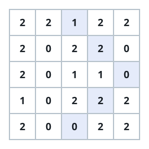
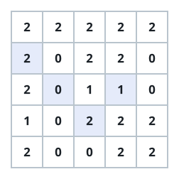
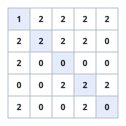

# Longest Bent Diagonal Trail

## Description

You are given an `n x m` integer matrix `grid` whose entries are each `0`,
`1`, or `2`.

A bent diagonal trail is a walk through the matrix that satisfies all of
the following:

- Its first cell holds a `1`.
- Every later cell continues the endless pattern `2, 0, 2, 0, ...` — the
  second cell holds `2`, the third `0`, and so on.
- The walk moves cell to cell along one of the four diagonal directions
  (top-left to bottom-right, bottom-right to top-left, top-right to
  bottom-left, or bottom-left to top-right), and along the way it may make
  at most one 90-degree clockwise turn onto another diagonal direction,
  picking up the pattern where it left off.

Return the number of cells in the longest bent diagonal trail, or `0` if no
such trail exists.

### Example 1



```text
Input: grid = [[2,2,1,2,2],[2,0,2,2,0],[2,0,1,1,0],[1,0,2,2,2],[2,0,0,2,2]]
Output: 5
Explanation: A trail of 5 cells starts at (0,2) and runs to (1,3) then
(2,4). At (2,4) it turns 90 degrees clockwise and continues through (3,3)
to (4,2).
```

### Example 2



```text
Input: grid = [[2,2,2,2,2],[2,0,2,2,0],[2,0,1,1,0],[1,0,2,2,2],[2,0,0,2,2]]
Output: 4
Explanation: A trail of 4 cells starts at (2,3) and steps to (3,2). At
(3,2) it turns 90 degrees clockwise and runs through (2,1) to (1,0).
```

### Example 3



```text
Input: grid = [[1,2,2,2,2],[2,2,2,2,0],[2,0,0,0,0],[0,0,2,2,2],[2,0,0,2,0]]
Output: 5
Explanation: A trail of 5 cells runs straight down the main diagonal from
(0,0) through (1,1), (2,2), and (3,3) to (4,4), holding the values
1, 2, 0, 2, 0.
```

### Example 4

```text
Input: grid = [[2,1,0],[2,2,2],[0,0,2]]
Output: 3
Explanation: A trail of 3 cells starts at (0,1) and steps to (1,2),
holding 2. At (1,2) it turns 90 degrees clockwise and continues to (2,1),
holding 0.
```

### Constraints

- `n == grid.length`
- `m == grid[i].length`
- `1 <= n, m <= 500`
- Every `grid[i][j]` is `0`, `1`, or `2`.

## Hints

### Hint 1

Decide for every cell where the single clockwise turn happens — dynamic
programming can settle that while the required values keep alternating.

### Hint 2

Carry states of the form (row, column, direction, turned-yet). Each state
answers "how far can the trail continue from here", and the transitions
follow the diagonal steps and the one allowed turn.
