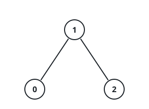

# Rows Joined By Shared Values

## Description

You are given a 2D integer array `properties` with `n` rows of length
`m`, and an integer `k`.

Write `intersect(a, b)` for the number of distinct integers that appear
in both array `a` and array `b`.

Build an undirected graph with one node for every row: nodes `i` and `j`
(`i != j`) are joined by an edge exactly when
`intersect(properties[i], properties[j]) >= k`.

Report how many connected components this graph has.

### Example 1


```text
Input: properties = [[1,2],[1,1],[3,4],[4,5],[5,6],[7,7]], k = 1
Output: 3
Explanation: The graph comes out with 3 connected components:
```

### Example 2



```text
Input: properties = [[1,2,3],[2,3,4],[4,3,5]], k = 2
Output: 1
Explanation: The graph comes out with 1 connected component:
```

### Example 3

```text
Input: properties = [[8,8,3],[3,9,9],[5,5]], k = 1
Output: 2
Explanation: Repeated values inside a row count once, so the rows
collapse to the sets {8,3}, {3,9}, and {5}. The first two rows share the
value 3 and join; the third shares nothing with either, so the graph has
2 components.
```

### Constraints

- `1 <= n == properties.length <= 100`
- `1 <= m == properties[i].length <= 100`
- `1 <= properties[i][j] <= 100`
- `1 <= k <= m`

## Hints

### Hint 1

To size the overlap of two rows without double counting, collapse each
row into a set of its values first — then the overlap is just the size
of the sets' intersection.

### Hint 2

Once every pairwise overlap is known, the remaining question is ordinary
component counting; a DFS, BFS, or disjoint-set union over the implied
edges all settle it.
