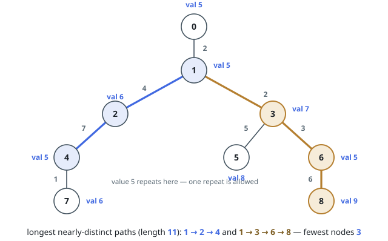
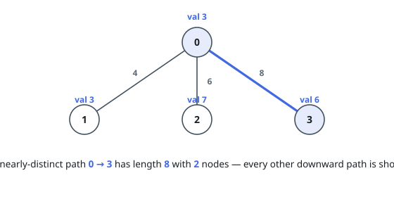

# Longest Distinct-Value Path With One Repeat

## Description

You are given a tree of `n` nodes rooted at node `0`, numbered `0` to `n - 1`,
described by a 2D array `edges` of length `n - 1`: `edges[i] = [u, v, len]`
joins `u` and `v` by an edge of length `len`. An integer array `nums` gives the
value sitting at each node, `nums[i]` belonging to node `i`.

Call a downward path — from some node to one of its descendants, possibly the
node alone — **nearly distinct** when every value on it is distinct, except
that a single value is allowed to appear twice.

Return an array `result` of size 2: `result[0]` is the greatest total length of
any nearly-distinct downward path, and `result[1]` is the fewest nodes such a
longest path can have.

### Example 1

```text
Input: edges = [[0,1,2],[1,2,4],[1,3,2],[2,4,7],[4,7,1],[3,5,5],[3,6,3],[6,8,6]], nums = [5,5,6,7,5,8,5,6,9]
Output: [11,3]
Explanation: Two paths reach length 11: 1 -> 2 -> 4 (values 5, 6, 5 — the 5
repeats once, which is allowed) and 1 -> 3 -> 6 -> 8 (values 5, 7, 5, 9 — again
one repeat). The first uses only 3 nodes, so result[1] is 3. Extending either
path toward the root repeats the value 5 a third time, and 1 -> 2 -> 4 -> 7
repeats both 5 and 6.
```



### Example 2

```text
Input: edges = [[1,0,4],[0,2,6],[0,3,8]], nums = [3,3,7,6]
Output: [8,2]
Explanation: The tree is a star around 0. The edge to 3 is the heaviest, and
the path 0 -> 3 holds two distinct values, so the answer is its length 8 with
2 nodes.
```



### Constraints

- `2 <= n <= 5 * 10⁴`
- `edges.length == n - 1`
- `edges[i].length == 3`
- `0 <= u, v < n`
- `1 <= len <= 10³`
- `nums.length == n`
- `0 <= nums[i] <= 5 * 10⁴`
- `edges` describes a valid tree.

## Hints

### Hint 1

Walk the tree depth-first from the root carrying the current root-to-node path
and prefix sums of the edge lengths, so the total length of any downward window
ending at the current node reads off in constant time.

### Hint 2

Track, per value, where it last occurred on the path, and carry two window
starts: one admitting only distinct values, and a second, never-smaller one
that still tolerates one value seen twice. A value reappearing inside a window
pushes the starts forward.

### Hint 3

DFS backtracks, so snapshot enough state — last occurrences and both window
starts — on the way in, and put it back exactly on the way out.
