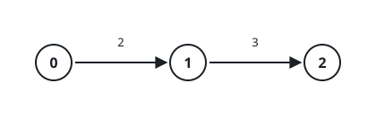

# Base Unit Equivalents I

## Description

There are `n` kinds of units, numbered `0` to `n - 1`, and unit `0` is the
base unit. You are given a 2D integer array `conversions` of length `n - 1`
where `conversions[i] = [sourceUniti, targetUniti, factori]`, meaning one
unit of kind `sourceUniti` equals `factori` units of kind `targetUniti`.

Return an array `equivalents` of length `n` where `equivalents[i]` is how
many units of kind `i` one unit of kind `0` is worth. Each entry may be
enormous, so report it modulo `10⁹ + 7`.

### Example 1



```text
Input: conversions = [[0,1,2],[1,2,3]]
Output: [1,2,6]
Explanation:
One unit of kind 0 is worth 2 units of kind 1. Chaining the second
conversion, those 2 units of kind 1 are worth 6 units of kind 2.
```

### Example 2

```text
Input: conversions = [[0,1,3],[1,2,2],[0,3,5],[3,4,4]]
Output: [1,3,6,5,20]
Explanation:
Kind 1 is worth 3, so kind 2 — reached through kind 1 — is worth 6. Kind 3
branches straight off the base with factor 5, and kind 4 extends it by 4,
reaching 20.
```

### Example 3

```text
Input: conversions = [[0,1,1000000000],[1,2,999999999]]
Output: [1,1000000000,56]
Explanation:
Kind 2 is worth 1,000,000,000 × 999,999,999 = 999,999,999,000,000,000
units, whose remainder modulo 10⁹ + 7 is 56.
```

### Constraints

- `2 <= n <= 10⁵`
- `conversions.length == n - 1`
- `0 <= sourceUniti, targetUniti < n`
- `1 <= factori <= 10⁹`
- Unit `0` can reach every other unit by exactly one sequence of
  conversions, and no conversion is ever used in reverse.

## Hints

### Hint 1

Those reachability facts make the conversions a weighted directed tree
growing out of unit `0`.

### Hint 2

Walk outward from unit `0` — one BFS suffices — and give each unit the
product of the factors along its path, reducing modulo `10⁹ + 7` at every
step.
