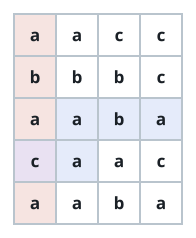
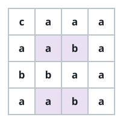

# Cells Covered In Both Directions

## Description

You are given an `m x n` matrix `grid` of characters and a string
`pattern`.

A horizontal read goes through the grid left to right; when it runs off
the end of a row it continues from the first column of the following row,
and it never wraps past the bottom row. A vertical read goes top to bottom;
when it runs off the bottom of a column it continues from the first row of
the following column, and it never wraps past the last column.

A horizontal (vertical) occurrence of `pattern` is a contiguous run of
`pattern.length` characters along one of these reads whose characters
spell out `pattern`.

Count the cells that lie on at least one horizontal occurrence and on at
least one vertical occurrence of `pattern`, and return that count.

### Example 1



```text
Input: grid = [["a","a","c","c"],["b","b","b","c"],["a","a","b","a"],["c","a","a","c"],["a","a","b","a"]], pattern = "abaca"
Output: 1
Explanation: The pattern "abaca" occurs exactly once along a horizontal
read (the highlighted row path) and once along a vertical read (the
highlighted column path), and the two occurrences share a single cell —
the one where both highlights overlap.
```

### Example 2



```text
Input: grid = [["c","a","a","a"],["a","a","b","a"],["b","b","a","a"],["a","a","b","a"]], pattern = "aba"
Output: 4
Explanation: Four cells sit on both a horizontal and a vertical occurrence
of "aba" — exactly the cells marked by the two highlight colors above.
```

### Example 3

```text
Input: grid = [["a","a"],["b","b"]], pattern = "ab"
Output: 2
Explanation: The only horizontal occurrence covers the first row, so the
top two cells are horizontally covered. The vertical reads spell "ab" in
both columns, covering all four cells vertically. Only the top two cells
are covered in both directions.
```

### Constraints

- `m == grid.length`
- `n == grid[i].length`
- `1 <= m, n <= 1000`
- `1 <= m * n <= 10⁵`
- `1 <= pattern.length <= m * n`
- `grid` and `pattern` consist of only lowercase English letters.

## Hints

### Hint 1

Each read order flattens the grid into a single string — rows joined in
order for horizontal, columns joined in order for vertical — and a wrapped
occurrence of `pattern` is just an ordinary occurrence in that string.

### Hint 2

Find every occurrence in both flattenings with a linear-time string
matcher, sweep each direction's matched ranges over a difference array,
and keep the cells whose row-major position and column-major position are
both covered.
