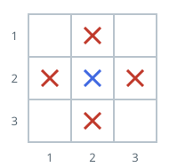

# Buildings Flanked On All Sides

## Description

Picture an `n x n` district. You are given the integer `n` and a list
`buildings`, where `buildings[i] = [x, y]` is the position of one building;
no two entries share a position.

A building is flanked when, scanning straight out from it along the grid,
there is at least one other building in each of the four directions: left,
right, above, and below.

Return how many of the buildings are flanked.

### Example 1



```text
Input: n = 3, buildings = [[1,2],[2,2],[3,2],[2,1],[2,3]]
Output: 1
Explanation:
Only the building at [2,2] is flanked. In every direction it can spot
another building:

    above: [1,2]
    below: [3,2]
    left:  [2,1]
    right: [2,3]

Every other building is missing a neighbor in at least one direction, so
the answer is 1.
```

### Example 2


```text
Input: n = 3, buildings = [[1,1],[1,2],[2,1],[2,2]]
Output: 0
Explanation: With only these four placements, no building sees a neighbor
in all four directions at once.
```

### Example 3


```text
Input: n = 5, buildings = [[1,3],[3,2],[3,3],[3,5],[5,3]]
Output: 1
Explanation:
Only the building at [3,3] qualifies — [1,3] sits above it, [5,3] below,
[3,2] to its left, and [3,5] to its right — so the answer is 1.
```

### Constraints

- `2 <= n <= 10⁵`
- `1 <= buildings.length <= 10⁵`
- `buildings[i] = [x, y]` and `1 <= x, y <= n`
- No two buildings occupy the same position.

## Hints

### Hint 1

Having a neighbor left or right depends only on the other buildings that
share the same x: the building's y must fall strictly between the smallest
and largest y seen on that x-line.

### Hint 2

The same holds vertically per y-line. Sweep once to record the four
per-line extremes, then re-walk the buildings and count those strictly
inside both ranges.
