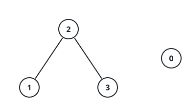

# Linked Across Value Gaps I

## Description

There are `n` nodes labeled `0` through `n - 1`. You are also given an
array `nums` of `n` values given in non-decreasing order, and an integer
`maxDiff`.

Connect two nodes with an undirected edge whenever their values are close:
`|nums[i] - nums[j]| <= maxDiff`.

For each `queries[i] = [ui, vi]`, decide whether `ui` and `vi` end up in
the same piece of this graph, i.e. whether some sequence of edges links
one to the other.

Return a boolean array `answer` where `answer[i]` says whether the i-th
pair is linked.

### Example 1

```text
Input: n = 5, nums = [2,5,9,11,15], maxDiff = 3, queries = [[0,1],[1,4],[2,3],[0,4],[3,3]]
Output: [true,false,true,false,true]
Explanation:
Values 3 apart or less share an edge: 0-1 (gap 3) and 2-3 (gap 2) are
edges; every other pair is too far apart. That splits the nodes into the
groups {0,1}, {2,3}, and {4}, and each query simply asks whether its two
nodes land in the same group.
```

### Example 2



```text
Input: n = 4, nums = [2,5,6,8], maxDiff = 2, queries = [[0,1],[0,2],[1,3],[2,3]]
Output: [false,false,true,true]
Explanation:
The gaps 0→1 and 0→2 are 3 and 4, beyond maxDiff, so neither pair is
linked. Node 1 reaches node 3 by stepping through node 2 (gaps 1 and 2),
and nodes 2 and 3 are joined directly since their gap equals maxDiff.
```

### Example 3

```text
Input: n = 6, nums = [7,7,7,9,10,16], maxDiff = 2, queries = [[0,5],[2,4],[3,3],[5,5]]
Output: [false,true,true,true]
Explanation:
The first five values chain together with gaps of 0, 0, 2, and 1, while 16
stands alone — its gap of 6 to the nearest value exceeds maxDiff. Every
node also counts as linked to itself.
```

### Constraints

- `1 <= n == nums.length <= 10⁵`
- `0 <= nums[i] <= 10⁵`
- `nums` is non-decreasing.
- `0 <= maxDiff <= 10⁵`
- `1 <= queries.length <= 10⁵`
- `queries[i] == [ui, vi]` and `0 <= ui, vi < n`

## Hints

### Hint 1

Edges only ever join values that are near each other in the sorted order.
Can a linked group skip over an index and pick up again further right?

### Hint 2

Sweep the array once and open a new group wherever the jump from the
previous value exceeds `maxDiff`; a query is true exactly when both nodes
fall in the same group.
