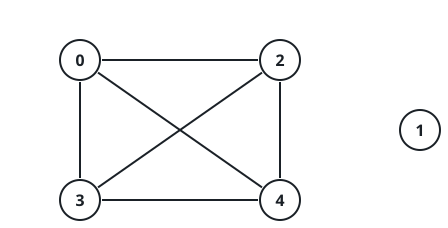
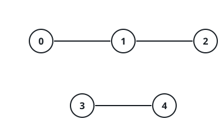

# Linked Across Value Gaps II

## Description

There are `n` nodes labeled `0` through `n - 1`. You are given an array
`nums` of `n` values and an integer `maxDiff`.

Join two nodes with an undirected edge whenever their values are close:
`|nums[i] - nums[j]| <= maxDiff`. Every edge counts as exactly one step.

For each `queries[i] = [ui, vi]`, work out the fewest steps that separate
`ui` from `vi`; when no chain of edges connects the pair, that query's
result is `-1`.

Return an array `answer` holding each query's result.

### Example 1



```text
Input: n = 5, nums = [1,8,3,4,2], maxDiff = 3, queries = [[0,3],[2,4]]
Output: [1,1]
Explanation:
Node 0 (value 1) and node 3 (value 4) sit 3 apart, right at the limit, so
one edge joins them; node 2 (value 3) and node 4 (value 2) are 1 apart.
Both queries are settled with a single step. The figure shows the graph
these edges form.
```

### Example 2



```text
Input: n = 5, nums = [5,3,1,9,10], maxDiff = 2, queries = [[0,1],[0,2],[2,3],[4,3]]
Output: [1,2,-1,1]
Explanation:
Nodes 0 and 1 differ by 2 — one step. Nodes 0 and 2 differ by 4, too far
for a direct edge, but 0 → 1 → 2 takes two steps. Node 2 (value 1) and
node 3 (value 9) are 8 apart with nothing bridging the gap, so that pair
never connects. Nodes 4 and 3 differ by 1 — one step.
```

### Example 3

```text
Input: n = 6, nums = [10,2,14,5,8,1], maxDiff = 4, queries = [[2,4],[1,4],[5,3],[0,0]]
Output: [2,2,1,0]
Explanation:
Node 2 (value 14) has no edge to node 4 (value 8) — 6 apart — but reaches
it in two steps by way of node 0 (value 10). Node 1 (value 2) likewise
needs two steps, through node 3 (value 5). Nodes 5 (value 1) and 3 are
exactly maxDiff apart: one step. A node is always 0 steps from itself.
```

### Constraints

- `1 <= n == nums.length <= 10⁵`
- `0 <= nums[i] <= 10⁵`
- `0 <= maxDiff <= 10⁵`
- `1 <= queries.length <= 10⁵`
- `queries[i] == [ui, vi]` and `0 <= ui, vi < n`

## Hints

### Hint 1

Place the nodes in increasing value order. What shape does the region a
single step can reach take in that order, and can a linked group skip an
index?

### Hint 2

One step from any sorted position covers a contiguous stretch — so the
ground covered after 2, 4, 8, … steps can be composed by doubling.

### Hint 3

Table the farthest position reachable within `2^k` steps for every k
(binary lifting over those doubling reaches); each query then needs only a
logarithmic descent to count steps, or to report `-1` for a split pair.
