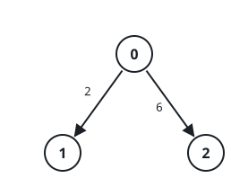
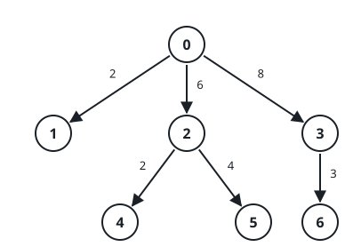

# Base Unit Equivalents II

## Description

There are `n` kinds of units, numbered `0` to `n - 1`, and unit `0` is the
base unit. You are given a 2D integer array `conversions` of length `n - 1`
where `conversions[i] = [sourceUniti, targetUniti, factori]`, meaning one
unit of kind `sourceUniti` equals `factori` units of kind `targetUniti`.
Every conversion can also be read in reverse — `factori` units of kind
`targetUniti` make one unit of kind `sourceUniti` — so worths need not be
whole numbers.

For each `queries[i] = [unitAi, unitBi]`, work out how many units of kind
`unitBi` one unit of kind `unitAi` is worth. That worth is some fraction
`p/q` in lowest terms, so report `answer[i]` as `p·q⁻¹` modulo `10⁹ + 7`,
where `q⁻¹` is the multiplicative inverse of `q` modulo `10⁹ + 7`.

Return the array `answer`.

### Example 1



```text
Input: conversions = [[0,1,2],[0,2,6]], queries = [[1,2],[1,0]]
Output: [3,500000004]
Explanation:
One base unit is worth 2 of kind 1 and 6 of kind 2, so one unit of kind 1
converts to 3 of kind 2. Read backward, the first conversion makes one
unit of kind 1 worth 1/2 of kind 0, reported as the inverse of 2 —
500000004.
```

### Example 2



```text
Input: conversions = [[0,1,2],[0,2,6],[0,3,8],[2,4,2],[2,5,4],[3,6,3]],
queries = [[1,2],[0,4],[6,5],[4,6],[6,1]]
Output: [3,12,1,2,83333334]
Explanation:
Measured in base units, the kinds are worth [1, 2, 6, 8, 12, 24, 24]. Kind
1 still converts to 3 of kind 2. One unit of kind 0 buys 6 × 2 = 12 of
kind 4. Kinds 6 and 5 are both worth 24, so they swap one-for-one; one
unit of kind 4 (worth 12) buys 2 of kind 6 (worth 24). And one unit of
kind 6 buys 24/2 = 1/12 of kind 1, reported as the inverse of 12 —
83333334.
```

### Constraints

- `2 <= n <= 10⁵`
- `conversions.length == n - 1`
- `0 <= sourceUniti, targetUniti < n`
- `1 <= factori <= 10⁹`
- `1 <= q == queries.length <= 10⁵`
- `queries[i] == [unitAi, unitBi]` and `0 <= unitAi, unitBi < n`
- Unit `0` reaches every other unit through exactly one chain of forward
  and backward conversions.

## Hints

### Hint 1

Root the conversions at unit 0 and fill a table `fromRoot`: how many units
of kind `a` one base unit is worth, multiplying the factors along the
unique path modulo `10⁹ + 7`.

### Hint 2

A pair query is just the ratio `fromRoot[unitBi] / fromRoot[unitAi]` —
turn the division into a multiplication using the modular inverse.
