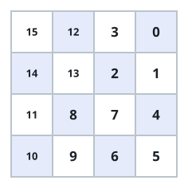

# The Rising Quadrant Grid

## Description

You are given a non-negative integer `n` describing a `2ⁿ x 2ⁿ` grid. Fill
it with every integer from `0` to `2²ⁿ - 1` so the grid becomes a rising
quadrant grid, which means all of the following hold:

- Every number in the top-right quadrant is smaller than every number in
  the bottom-right quadrant.
- Every number in the bottom-right quadrant is smaller than every number
  in the bottom-left quadrant.
- Every number in the bottom-left quadrant is smaller than every number in
  the top-left quadrant.
- Each of the four quadrants is itself a rising quadrant grid.

Return the resulting `2ⁿ x 2ⁿ` grid.

Note: any 1x1 grid qualifies automatically.

### Example 1



```text
Input: n = 2
Output: [[15,12,3,0],[14,13,2,1],[11,8,7,4],[10,9,6,5]]
Explanation: Reading the quadrants:
- Top-right: 3, 0, 2, 1
- Bottom-right: 7, 4, 6, 5
- Bottom-left: 11, 8, 10, 9
- Top-left: 15, 12, 14, 13
- max(3, 0, 2, 1) < min(7, 4, 6, 5)
- max(7, 4, 6, 5) < min(11, 8, 10, 9)
- max(11, 8, 10, 9) < min(15, 12, 14, 13)
so the first three requirements hold, and each quadrant repeats the same
pattern on its own scale.
```

### Example 2

```text
Input: n = 3
Output: [[63,60,51,48,15,12,3,0],[62,61,50,49,14,13,2,1],[59,56,55,52,11,8,7,4],[58,57,54,53,10,9,6,5],[47,44,35,32,31,28,19,16],[46,45,34,33,30,29,18,17],[43,40,39,36,27,24,23,20],[42,41,38,37,26,25,22,21]]
Explanation:
Each quadrant of this 8x8 grid is exactly the 4x4 grid from Example 1,
offset by the size of the blocks that come before it: the top-right block
holds 0-15, the bottom-right 16-31, the bottom-left 32-47, and the
top-left 48-63.
```

### Example 3

```text
Input: n = 4
Output: [[255,252,243,240,207,204,195,192,63,60,51,48,15,12,3,0],[254,253,242,241,206,205,194,193,62,61,50,49,14,13,2,1],[251,248,247,244,203,200,199,196,59,56,55,52,11,8,7,4],[250,249,246,245,202,201,198,197,58,57,54,53,10,9,6,5],[239,236,227,224,223,220,211,208,47,44,35,32,31,28,19,16],[238,237,226,225,222,221,210,209,46,45,34,33,30,29,18,17],[235,232,231,228,219,216,215,212,43,40,39,36,27,24,23,20],[234,233,230,229,218,217,214,213,42,41,38,37,26,25,22,21],[191,188,179,176,143,140,131,128,127,124,115,112,79,76,67,64],[190,189,178,177,142,141,130,129,126,125,114,113,78,77,66,65],[187,184,183,180,139,136,135,132,123,120,119,116,75,72,71,68],[186,185,182,181,138,137,134,133,122,121,118,117,74,73,70,69],[175,172,163,160,159,156,147,144,111,108,99,96,95,92,83,80],[174,173,162,161,158,157,146,145,110,109,98,97,94,93,82,81],[171,168,167,164,155,152,151,148,107,104,103,100,91,88,87,84],[170,169,166,165,154,153,150,149,106,105,102,101,90,89,86,85]]
Explanation:
The 16x16 grid is four copies of the 8x8 grid from Example 2, arranged so
the values climb top-right, bottom-right, bottom-left, top-left: the
blocks cover 0-63, 64-127, 128-191, and 192-255 in that order.
```

### Constraints

- `0 <= n <= 10`

## Hints

### Hint 1

Think recursively: decide what each quadrant must contain, then build each
quadrant the same way.

### Hint 2

The quadrant values form four consecutive blocks, so you can also work
bottom-up — start from the 1x1 grid and rebuild every row twice per level,
once in the top half and once in the bottom half, with the right offsets.
