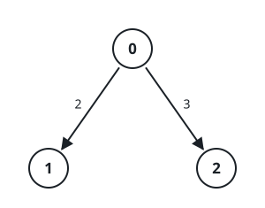
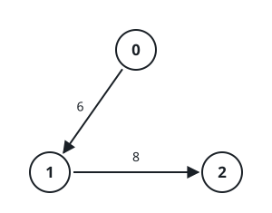

# Heaviest K-Edge Route Under The Cap

## Description

You are given an integer `n` and a directed acyclic graph over `n` nodes
labeled `0` through `n - 1`. The graph arrives as a 2D array `edges`,
where `edges[i] = [ui, vi, wi]` is a one-way connection from `ui` to `vi`
carrying weight `wi`.

You are also given two integers, `k` and `t`.

Choose a route made of exactly `k` connections joined end to end and add
up their weights. Among every route whose total stays strictly below the
cap `t`, return the largest total achievable. If no route of exactly `k`
edges fits under the cap, return `-1`.

### Example 1


```text
Input: n = 3, edges = [[0,1,1],[1,2,2]], k = 2, t = 4
Output: 3
Explanation: The graph offers a single two-edge route, 0 → 1 → 2, and
its weights add up to 1 + 2 = 3, which sits under the cap of 4. So 3 is
the answer.
```

### Example 2



```text
Input: n = 3, edges = [[0,1,2],[0,2,3]], k = 1, t = 3
Output: 2
Explanation: Both one-edge routes leave node 0. The one into node 1
weighs 2 and qualifies; the one into node 2 weighs exactly 3 — the cap
itself — and strictness disqualifies it. The best qualifying total is 2.
```

### Example 3



```text
Input: n = 3, edges = [[0,1,6],[1,2,8]], k = 1, t = 6
Output: -1
Explanation: Each single edge misses the strict cut: 0 → 1 weighs exactly
6, the cap's value, and 1 → 2 weighs 8. Nothing with one edge lands below
the cap, so the answer is -1.
```

### Constraints

- `1 <= n <= 300`
- `0 <= edges.length <= 300`
- `edges[i] = [ui, vi, wi]`
- `0 <= ui, vi < n`
- `ui != vi`
- `1 <= wi <= 10`
- `0 <= k <= 300`
- `1 <= t <= 600`
- The given graph is guaranteed to be acyclic.
- No two connections share the same start and end.

## Hints

### Hint 1

Run dynamic programming over (edges used, endpoint) and keep track of
every weight total that is both reachable and still below the cap.

### Hint 2

Weights are never zero, so a route's total only grows as it extends: a
partial total that has already reached `t` can be discarded mid-way
without ever losing a qualifying route.

### Hint 3

One bitmask per node keeps the bookkeeping tight — after `j` rounds, bit
`s` of node `v`'s mask says some `j`-edge route ends at `v` with total
exactly `s`.
