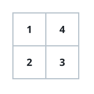

# One-Cut Grid Halves

## Description

You are given an `m x n` matrix `grid` filled with positive integers. A
single straight cut — one horizontal line or one vertical line — divides
the matrix into two pieces. Decide whether some such cut can leave both
pieces with the same element sum.

Both pieces must be non-empty. Return `true` if a balancing cut exists and
`false` otherwise.

### Example 1




```text
Input: grid = [[1,4],[2,3]]
Output: true
Explanation: Slicing between the two rows leaves {1,4} above the cut and
{2,3} below it, and both groups sum to 5. The answer is true.
```

### Example 2

```text
Input: grid = [[3,1],[1,3]]
Output: true
Explanation: Every row and every column sums to 4, so the cut between the
two columns — just as well the cut between the two rows — yields two
sections of equal weight.
```

### Example 3

```text
Input: grid = [[1,2],[4,2]]
Output: false
Explanation: The four cells total 9, an odd number, and two integer sums
can never split an odd total evenly, so the answer is false.
```

### Constraints

- `1 <= m == grid.length <= 10⁵`
- `1 <= n == grid[i].length <= 10⁵`
- `2 <= m * n <= 10⁵`
- `1 <= grid[i][j] <= 10⁵`

## Hints

### Hint 1

A single straight cut can only move a contiguous run of whole rows, or a
contiguous run of whole columns, from one side to the other.

### Hint 2

Total the grid once. Two matching sections must each hold exactly half of
that total, so an odd total rules out every cut at once.

### Hint 3

Sweep the rows from the top, accumulating row sums, and watch for the
running total reaching `total / 2` before the final row.

### Hint 4

Run the same accumulation over the columns; if neither sweep ever reaches
the half-total, no balanced cut exists.
