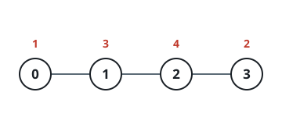
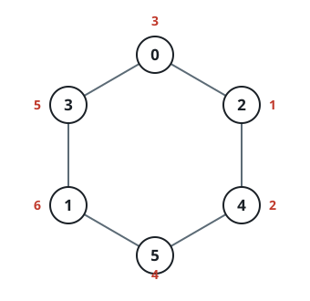

# Richest Graph Labeling

## Description

An undirected, connected graph contains `n` nodes numbered `0` through
`n - 1`, and every node touches at most two others. The `m` edges arrive as
a 2D array `edges`, where `edges[i] = [ai, bi]` joins nodes `ai` and `bi`.

Your job is to hand out the numbers `1` through `n` — one apiece, no
repeats — as labels for the nodes. An edge then becomes worth the product
of the two labels at its ends, and your score is the total worth of every
edge in the graph.

Return the largest score any labeling can reach.

### Example 1



```text
Input: n = 4, edges = [[0,1],[1,2],[2,3]]
Output: 23
Explanation:
The drawing above shows the best placement for this path. Its three edges
are worth 1 * 3, 3 * 4, and 4 * 2, which together give 23.
```

### Example 2



```text
Input: n = 6, edges = [[0,3],[4,5],[2,0],[1,3],[2,4],[1,5]]
Output: 82
Explanation:
With the placement drawn above, the six edge products 1 * 2, 2 * 4, 4 * 6,
6 * 5, 5 * 3, and 3 * 1 add up to 82.
```

### Constraints

- `1 <= n <= 5 * 10⁴`
- `m == edges.length`
- `1 <= m <= n`
- `edges[i].length == 2`
- `0 <= ai, bi < n`
- `ai != bi`
- No edge appears more than once.
- The graph is connected.
- Every node is adjacent to at most 2 other nodes.

## Hints

### Hint 1

Connectivity plus a degree cap of 2 leaves only two possible shapes: one
simple path or one simple cycle.

### Hint 2

Count the edges to tell them apart — a path has `m = n - 1` edges while a
cycle has `m = n`.

### Hint 3

Large labels earn the most when they label adjacent nodes, so the optimal
placement puts the biggest numbers side by side and lets the smallest
number soak up the weakest adjacency (on a cycle, that is the edge that
closes the loop).

### Hint 4

Order the labels like a pendulum — odds ascending, then evens descending —
and sum the products of neighboring entries; on a cycle, close the sum with
the product of the two ends.
