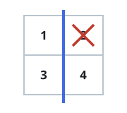
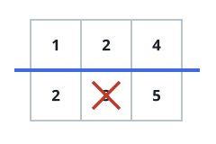

# One-Cut Grid Halves II

## Description

You are given an `m x n` matrix `grid` of positive integers. As before, one
horizontal cut or one vertical cut divides the matrix into two non-empty
sections — but this time the two section sums do not have to match exactly.
You may ignore one single cell, across both sections combined, when
comparing the sums.

There is one restriction: if a cell is ignored, what remains of its section
must still be connected. A section is connected when every cell in it can
reach every other cell by stepping up, down, left, or right through cells
of that same section.

Return `true` if some cut — with at most one cell ignored — balances the
matrix, and `false` otherwise.

### Example 1


```text
Input: grid = [[1,4],[2,3]]
Output: true
Explanation: Cutting below the first row leaves sums 1 + 4 = 5 and
2 + 3 = 5. The sides already agree, so no cell needs to be ignored, and
the answer is true.
```

### Example 2



```text
Input: grid = [[1,2],[3,4]]
Output: true
Explanation: Cutting right of the first column leaves sums 1 + 3 = 4 and
2 + 4 = 6. Ignoring the 2 in the right section brings it down to 4, and the
remaining three cells of that section stay connected, so the answer is
true.
```

### Example 3



```text
Input: grid = [[1,2,4],[2,3,5]]
Output: false
Explanation: Cutting below the first row gives 1 + 2 + 4 = 7 and
2 + 3 + 5 = 10. Ignoring the 3 in the bottom section would level the sums,
but the two remaining bottom cells no longer touch each other, so that
discount is illegal — and no other cut works either. The answer is false.
```

### Example 4

```text
Input: grid = [[5,1],[1,1]]
Output: false
Explanation: Either cut leaves sides of 6 and 2, so the heavier side would
have to shed a cell worth 4. But the heavier section is always a
single-cell-wide slab, and only its two end cells (values 5 and 1) may be
removed without splitting it, so the answer is false.
```

### Constraints

- `1 <= m == grid.length <= 10⁵`
- `1 <= n == grid[i].length <= 10⁵`
- `2 <= m * n <= 10⁵`
- `1 <= grid[i][j] <= 10⁵`

## Hints

### Hint 1

A straight cut always produces two rectangular slabs. Knocking any single
cell out of a slab that spans at least two rows and two columns can never
disconnect it.

### Hint 2

The only fragile slabs are the one-cell-wide ones — a lone row or a lone
column — and there just its two end cells can be removed safely.

### Hint 3

Sweep each axis in both directions with a running prefix sum. At every
boundary, either the two sides already match, or the heavier side must
outweigh the lighter by the value of one cell that can legally leave it.

### Hint 4

Carry the set of values seen in the leading slab along each sweep so that
every candidate discount is answered with a single lookup.
