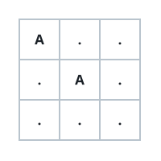

# Crossing The Grid Through Portals

## Description

`matrix` is a character grid with `m` rows and `n` columns, handed to you
as an array of strings — `matrix[i][j]` is the cell where row `i` meets
column `j`. Each cell holds one of three things:

- `'.'` — open floor.
- `'#'` — a wall that can never be entered.
- An uppercase letter (`'A'`-`'Z'`) — a portal.

You begin on cell `(0, 0)` and want to end up on `(m - 1, n - 1)`. From a
cell you may step to any of its four neighbors that stays inside the grid
and is not a wall; every step counts as one move.

Landing on a portal letter unlocks that letter: the first time you set
foot on any cell of a given letter, you may instantly jump to any other
cell in the grid holding that same letter. The jump itself is free — no
move is counted — and each letter works only once per journey.

Return the fewest moves needed to reach the far corner, or `-1` if it can
never be reached.

### Example 1



```text
Input: matrix = ["A..",".A.","..."]
Output: 2
Explanation:
Before spending any move, the free jump carries you from the 'A' at
(0, 0) to the 'A' at (1, 1). Two ordinary steps later — right, then
down — you stand on the corner.
```

### Example 2


```text
Input: matrix = [".#...",".#.#.",".#.#.","...#."]
Output: 13
```

### Example 3

```text
Input: matrix = ["A.#.","####","..#A"]
Output: 0
Explanation:
The start cell holds an 'A' whose only partner is the goal cell itself,
so the free jump completes the journey before a single move is made.
```

### Example 4

```text
Input: matrix = ["A#B","###","C#D"]
Output: -1
Explanation:
Walls seal off every walking route, and no letter repeats anywhere to
offer another way across — the corner stays out of reach.
```

### Constraints

- `1 <= m == matrix.length <= 10³`
- `1 <= n == matrix[i].length <= 10³`
- `matrix[i][j]` is `'#'`, `'.'`, or an uppercase English letter.
- `matrix[0][0]` is never a wall.

## Hints

### Hint 1

All cells bearing the same letter behave like one super-node: setting
foot on any one of them puts every other one within reach at no move
cost.

### Hint 2

The once-per-letter cap sounds restrictive but is harmless: a shortest
journey never needs the same letter twice.

### Hint 3

With steps costing 1 and jumps costing 0, run a breadth-first search in
layers — finish each layer's portal closures before taking that layer's
steps — and the layer that first touches the corner holds the answer.
