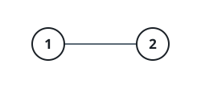
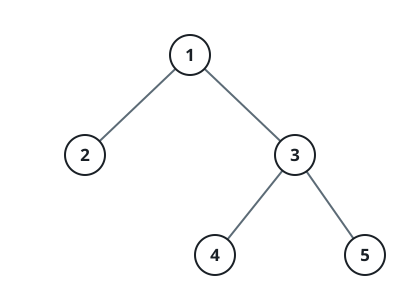

# Odd-Cost Paths To The Deepest Node I

## Description

An undirected tree holds `n` nodes numbered `1` to `n`, rooted at node
`1`, and arrives as `edges` — a list of `n - 1` pairs where
`edges[i] = [ui, vi]` joins nodes `ui` and `vi`.

Every edge starts at weight 0 and must end up carrying a weight of
exactly 1 or 2. The cost of the path between two nodes is the sum of the
weights along it.

Pick any one deepest node `x` — a node whose distance from the root, in
edges, is as large as the tree allows. Return the number of ways to
weight the edges on the path from node `1` to `x` so that the path's
total cost comes out odd, reported modulo `10⁹ + 7`.

Note: edges off that path are ignored — only the assignments along the
path itself are counted.

### Example 1



```text
Input: edges = [[1,2]]
Output: 1
Explanation:
The route from node 1 to node 2 is a single edge. Weighting it 1 gives
an odd cost; weighting it 2 gives an even one — so exactly one of the
two assignments qualifies.
```

### Example 2



```text
Input: edges = [[1,2],[1,3],[3,4],[3,5]]
Output: 2
Explanation:
The tree bottoms out at depth 2, where nodes 4 and 5 sit side by side;
either may serve as `x`. Taking node 4, the route 1 → 3 → 4 crosses two
edges, and the weight pairs (1, 2) and (2, 1) are the ones producing an
odd total — the answer is 2.
```

### Example 3

```text
Input: edges = [[1,2],[2,3],[3,4]]
Output: 4
Explanation:
The tree is a chain, so node 4 is deepest and its path carries three
edges. The odd totals come from an odd number of 1s among them —
(1,1,1), (1,2,2), (2,1,2), and (2,2,1) — four assignments in all.
```

### Constraints

- `2 <= n <= 10⁵`
- `edges.length == n - 1`
- `edges[i] == [ui, vi]`
- `1 <= ui, vi <= n`
- `edges` describes a valid tree.

## Hints

### Hint 1

Walk the tree once from the root to learn how deep every node sits and
note the largest depth reached — an explicit stack survives the long
chain that a recursion might not.

### Hint 2

A weight of 2 is parity-invisible: the path's cost is odd precisely when
an odd number of its edges carry the weight 1.

### Hint 3

The odd-size subsets of `d` edges number `2^(d-1)` — pair each one with
the subset obtained by flipping the first edge — so once the maximum
depth `d` is known, the answer falls straight out of it.
