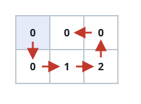

# One Walk Past Every Checkpoint

## Description

You are given an `m x n` array `grid` and an integer `k`. Exactly `k`
cells of `grid` hold the values `1` through `k` once each; every other
cell holds `0`.

Starting anywhere you like and stepping between edge-adjacent cells (up,
down, left, right), find one continuous walk that:

- sets foot on every cell of `grid` exactly once, and
- passes the numbered cells in ascending order — the cell holding 1, then
  the cell holding 2, and so on through `k`.

Return an array `result` of size `(m * n) x 2`, where `result[i] = [xi,
yi]` is the walk's i-th cell. When several walks qualify, any one is
accepted, and if no walk can satisfy both rules, return an empty array.

### Example 1



```text
Input: grid = [[0,0,0],[0,1,2]], k = 2
Output: [[0,0],[1,0],[1,1],[0,1],[0,2],[1,2]]
Explanation: The walk covers all six cells one time each, and it stands
on the cell holding 1 before it ever reaches the cell holding 2.
```

### Example 2

```text
Input: grid = [[1,3],[2,4]], k = 4
Output: []
Explanation: All four cells are numbered, so the walk would have to run
1 → 2 → 3 → 4 — from (0,0) down to (1,0), then diagonally to (0,1).
Diagonal steps are not allowed, so no walk exists.
```

### Example 3

```text
Input: grid = [[0,0],[1,0]], k = 1
Output: [[0,0],[1,0],[1,1],[0,1]]
Explanation: The single checkpoint imposes no ordering, so any walk that
sweeps all four cells works.
```

### Constraints

- `1 <= m == grid.length <= 5`
- `1 <= n == grid[i].length <= 5`
- `1 <= k <= m * n`
- `0 <= grid[i][j] <= k`
- The values `1` through `k` each appear exactly once in `grid`.

## Hints

### Hint 1

Search with recursive backtracking: extend the walk cell by cell and undo
a step when it leads nowhere.

### Hint 2

Prune aggressively — the walk alternates cell colors, so the unvisited
counts on each color must stay balanced, and the cells still to visit
must remain connected.
