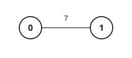
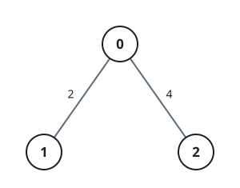

# Weighted Halfway Nodes

## Description

You are given an integer `n` and an undirected, weighted tree rooted at
node `0`, whose `n` nodes are numbered `0` to `n - 1`. The tree arrives
as an array `edges` of length `n - 1`, where `edges[i] = [ui, vi, wi]`
connects `ui` and `vi` with edge weight `wi`.

Walk a tree path from one endpoint to the other, collecting edge
weights as you go. The halfway node of that walk is the earliest node
`x` visited where the weight collected so far is at least half of the
path's total weight.

Given an array `queries` of node pairs, where each `queries[j] =
[uj, vj]`, answer `queries[j]` with the halfway node of the path
between `uj` and `vj`. Return the answers in an array `ans`, with
`ans[j]` holding the result for `queries[j]`.

### Example 1



```text
Input: n = 2, edges = [[0,1,7]], queries = [[1,0],[0,1]]
Output: [0,1]
Explanation: Both walks cover the single weight-7 edge. Starting from
    node 1, the collected weight is already 7 — at least half of the
    total 7 — the moment node 0 is reached, so node 0 answers the first
    query. The second query is symmetric and answers node 1.
```

### Example 2



```text
Input: n = 3, edges = [[0,1,2],[2,0,4]], queries = [[0,1],[2,0],[1,2]]
Output: [1,0,2]
Explanation: The first two walks each traverse one edge, so the far
    endpoint is reached with the full weight: node 1 answers [0, 1]
    (2 of a total 2), and node 0 answers [2, 0] (4 of a total 4). For
    [1, 2] the walk crosses weights 2 and 4, totalling 6; after the
    first edge only 2 is collected — short of half — and node 2 is the
    first stop where the running total 6 reaches 3.
```

### Example 3


```text
Input: n = 5, edges = [[0,1,2],[0,2,5],[1,3,1],[2,4,3]],
    queries = [[3,4],[1,2]]
Output: [2,2]
Explanation: The walk for [3, 4] pays edge weights 1, 2, 5, 3 in turn
    (total 11, half 5.5); the running sums are 1, 3, 8, so node 2 —
    where the sum first passes 5.5 — answers. The walk for [1, 2] pays
    2 then 5 (total 7, half 3.5); the sum 2 after node 0 is short, and
    node 2, with 7 collected, answers again.
```

### Constraints

- `2 <= n <= 10⁵`
- `edges.length == n - 1`
- `edges[i] == [ui, vi, wi]`
- `0 <= ui, vi < n`
- `1 <= wi <= 10⁹`
- `1 <= queries.length <= 10⁵`
- `queries[j] == [uj, vj]`
- `0 <= uj, vj < n`
- The input is generated such that edges represents a valid tree.

## Hints

### Hint 1

One depth-first sweep can record every node's parent, depth, and
weighted distance from the root; the lowest common ancestor of a query
pair then falls out of those tables.

### Hint 2

With the common ancestor `l` of `u` and `v`, the path total and the
weight already gathered on the first leg are both simple differences of
root distances.

### Hint 3

Keep the comparison in integers by asking for
`2 * collected >= total` — no halves, no rounding.

### Hint 4

Decide which leg of the path hosts the answer by testing the criterion
at the common ancestor, then binary-lift along that leg, jumping by
powers of two, to find the first node that satisfies it.
