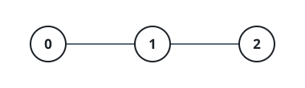

# Subtree XOR Rankings

## Description

A tree with `n` nodes is rooted at node 0; the nodes are numbered 0 to
n - 1. Node i carries the value vals[i], and par[i] names its parent.

Define the path XOR of a node u as the XOR of vals[i] over every node i
lying on the route that starts at the root and ends at u (both endpoints
included).

Each query is a pair queries[j] = [uj, kj]. Answering it means ranking the
distinct path XOR values that occur anywhere inside the subtree hanging
from uj, and reporting the one that would sit at position kj in sorted
order. When that subtree holds fewer than kj distinct path XOR values,
the answer for the query is -1.

Return an array whose jth entry answers the jth query.

Here the subtree of a node v is v together with every node whose route to
the root goes through v — v and all of its descendants.

### Example 1


```text
Input: par = [-1,0,0], vals = [1,1,1], queries = [[0,1],[0,2],[0,3]]
Output: [0,1,-1]
Explanation:

Path XOR values:

    Node 0: 1
    Node 1: 1 XOR 1 = 0
    Node 2: 1 XOR 1 = 0

Everything hangs below node 0, so its subtree collects the route XORs
[1, 0, 0] and the distinct set is {0, 1}.

Walking through the queries:

    queries[0] = [0, 1]: position 1 in the subtree's sorted distinct set
    holds 0.
    queries[1] = [0, 2]: position 2 holds 1.
    queries[2] = [0, 3]: only two distinct values exist here, so the
    answer is -1.

Output: [0, 1, -1]
```

### Example 2



```text
Input: par = [-1,0,1], vals = [5,2,7], queries = [[0,1],[1,2],[1,3],[2,1]]
Output: [0,7,-1,0]
Explanation:

Path XOR values:

    Node 0: 5
    Node 1: 5 XOR 2 = 7
    Node 2: 5 XOR 2 XOR 7 = 0

Distinct sets per subtree:

    Below 0: nodes [0, 1, 2] contribute [5, 7, 0], so the set is {0, 5, 7}.
    Below 1: nodes [1, 2] contribute [7, 0], so the set is {0, 7}.
    Below 2: only node [2], contributing [0], so the set is {0}.

Walking through the queries:

    queries[0] = [0, 1]: position 1 below node 0 holds 0.
    queries[1] = [1, 2]: position 2 below node 1 holds 7.
    queries[2] = [1, 3]: just two distinct values live in that subtree,
    so the answer is -1.
    queries[3] = [2, 1]: position 1 below node 2 holds 0.

Output: [0, 7, -1, 0]
```

### Constraints

- `1 <= n == vals.length <= 5 * 10⁴`
- `0 <= vals[i] <= 10⁵`
- `par.length == n`
- `par[0] == -1`
- `0 <= par[i] < n for i in [1, n - 1]`
- `1 <= queries.length <= 5 * 10⁴`
- `queries[j] == [uj, kj]`
- `0 <= uj < n`
- `1 <= kj <= n`
- The parent array par is guaranteed to describe a valid tree.

## Hints

### Hint 1

The XOR accumulated on the route from the root is a prefix quantity: the
value at a node equals its own val XORed with the path XOR of its parent,
so one traversal fills every node in.

### Hint 2

A subtree's distinct path-XOR set is the node's own value merged with the
sets of its children's subtrees. Merging the smaller set into the larger
one (small-to-large) during the traversal keeps the total work down to a
logarithmic number of moves per node.

### Hint 3

Keep each subtree's distinct values inside an order-statistics structure —
a balanced ordered set, or Python's sortedcontainers SortedList — so the
kth smallest can be read out cheaply.

### Hint 4

Group the queries by their node; the moment a node's set is complete,
answer each of its queries by direct positional lookup (index k - 1),
falling back to -1 when k exceeds the set's size.
