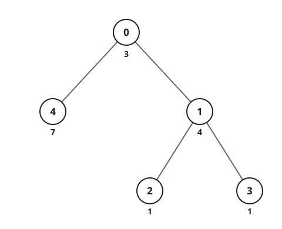

# Fewest Bumps To Level The Branches

## Description

You are given an integer n and a tree of n nodes rooted at node 0, with
the nodes numbered 0 to n - 1. The tree arrives as an array edges of
n - 1 pairs, where edges[i] = [ui, vi] joins nodes ui and vi.

Walking through node i costs cost[i], and a path's score is the total of
the costs of every node it visits.

Costs may only go up: any node's cost can be bumped by any non-negative
amount. Bump the costs so that every path from the root to a leaf ends up
with the same score, using as few bumped nodes as possible.

Return that minimum count of nodes whose cost must be raised.

### Example 1


```text
Input: n = 3, edges = [[0,1],[0,2]], cost = [2,1,3]
Output: 1
Explanation: Two root-to-leaf paths exist:
0 → 1 scores 2 + 1 = 3.
0 → 2 scores 2 + 3 = 5.
Bringing the first path up to 5 takes a bump of node 1's cost by 2, and
one bumped node is all it needs — so the answer is 1.
```

### Example 2


```text
Input: n = 3, edges = [[0,1],[1,2]], cost = [5,1,4]
Output: 0
Explanation: The tree holds a single root-to-leaf path:
0 → 1 → 2 scores 5 + 1 + 4 = 10.
With only one path there is nothing to balance, so the answer is 0.
```

### Example 3



```text
Input: n = 5, edges = [[0,4],[0,1],[1,2],[1,3]], cost = [3,4,1,1,7]
Output: 1
Explanation: Three root-to-leaf paths exist:
0 → 4 scores 3 + 7 = 10.
0 → 1 → 2 scores 3 + 4 + 1 = 8.
0 → 1 → 3 scores 3 + 4 + 1 = 8.
A single bump — raising node 1 by 2 — lifts both 8-score paths to 10 at
once, so the answer is 1.
```

### Constraints

- `2 <= n <= 10⁵`
- `edges.length == n - 1`
- `edges[i] == [ui, vi]`
- `0 <= ui, vi < n`
- `cost.length == n`
- `1 <= cost[i] <= 10⁹`
- The input is generated such that `edges` represents a valid tree.

## Hints

### Hint 1

Nothing can be lowered, so the shared final score is forced: it is the
largest raw root-to-leaf total, M.

### Hint 2

For each node v, work out how much raise its subtree still owes — the gap
between M and the largest raw path total among the root-to-leaf paths
running through v.

### Hint 3

The gap only grows as you descend. A node must be bumped exactly when its
gap is strictly larger than its parent's; counting those nodes answers
the problem.
