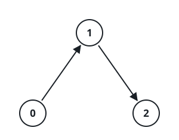
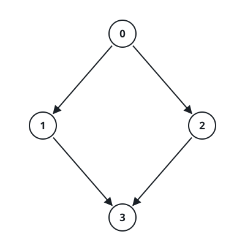
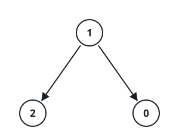

# Edges With Opening Hours

## Description

You are given an integer n and a set of one-way edges over the nodes `0`
to `n - 1`. Each edge is described by `edges[i] = [ui, vi, starti, endi]`:
it carries you from `ui` to `vi`, but only while the clock reads an
integer `t` satisfying `starti <= t <= endi` — think of it as the edge's
opening hours.

You stand on node `0` while the clock reads `0`. One unit of time at a
time, you may either:

- stay where you are and let the clock tick, or
- leave through an outgoing edge of your current node, provided the
  current time `t` lies inside that edge's window.

Return the earliest clock reading at which you can be standing on node
`n - 1`, or -1 if no schedule ever gets you there.

### Example 1



```text
Input: n = 3, edges = [[0,1,0,1],[1,2,2,5]]
Output: 3
Explanation: Ride 0 → 1 the moment the clock reads 0 — its window runs
from 0 to 1 — and land on node 1 at time 1, then sit out one tick. At
t = 2 the edge 1 → 2 has just opened (window 2 to 5), and riding it puts
you on node 2 at time 3.
```

### Example 2



```text
Input: n = 4, edges = [[0,1,0,3],[1,3,7,8],[0,2,1,5],[2,3,4,7]]
Output: 5
Explanation: Leave node 0 at t = 1 aboard 0 → 2 (window 1 to 5) and
arrive at t = 2. After two ticks of waiting, t = 4 falls inside the
window of 2 → 3 (4 to 7), and that ride delivers you to node 3 at t = 5.
The alternative via 0 → 1 cannot compete: 1 → 3 opens at t = 7, so even
a perfect transfer lands no earlier than t = 8.
```

### Example 3



```text
Input: n = 3, edges = [[1,0,1,3],[1,2,3,5]]
Output: -1
Explanation: Node 0 has no outgoing edges at all, so node 2 is forever
out of reach and the answer is -1.
```

### Constraints

- `1 <= n <= 10⁵`
- `0 <= edges.length <= 10⁵`
- `edges[i] == [ui, vi, starti, endi]`
- `0 <= ui, vi <= n - 1` and `ui != vi`
- `0 <= starti <= endi <= 10⁹`

## Hints

### Hint 1

Treat the clock reading as the distance: this is a shortest-path problem
solved by Dijkstra over the earliest time you can be standing on each
node, popped from a min-heap.

### Hint 2

From node u at time t, an edge `[u, v, start, end]` is only an option
while `t <= end`.

### Hint 3

If `t < start`, there is no cost to waiting — depart at `max(t, start)`;
the ride itself still consumes one tick, so you reach `v` at
`max(t, start) + 1`.
