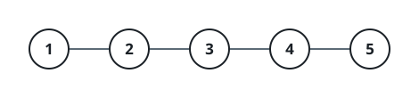

# On Call For Every Grid

## Description

You are given an integer `c`, the number of power stations on duty, each
carrying a unique id from `1` to `c`.

Bidirectional cables join some pairs of stations: `connections[i] =
[ui, vi]` links stations `ui` and `vi`. Stations that are linked directly
or through intermediaries share one power grid, and every station starts
online.

A log of events arrives as a 2D array `queries`, each entry one of:

- `[1, x]`: a maintenance check aimed at station `x`. If `x` is online it
  handles its own check. If `x` is offline, the check falls to the
  online station with the smallest id in `x`'s grid — record that id, or
  -1 when no station in that grid is online.
- `[2, x]`: station `x` is taken offline.

Return the recorded values for the `[1, x]` entries, in order of
appearance.

Note: taking a station offline never rewires anything — it stays part of
its grid, and the grid's connectivity is unchanged.

### Example 1



```text
Input: c = 5, connections = [[1,2],[2,3],[3,4],[4,5]], queries = [[1,3],[2,1],[1,1],[2,2],[1,2]]
Output: [3,2,3]
Explanation: All five stations start online in one shared grid.
[1,3]: station 3 is online, so it answers its own check.
[2,1]: station 1 goes offline; {2, 3, 4, 5} remain online.
[1,1]: station 1 is offline, so the smallest online id in its grid, 2,
takes the check.
[2,2]: station 2 goes offline; {3, 4, 5} remain online.
[1,2]: station 2 is offline, so station 3 — now the smallest online id —
answers.
```

### Example 2

```text
Input: c = 4, connections = [[1,3],[2,4]], queries = [[1,2],[2,3],[1,2],[1,3]]
Output: [2,2,1]
Explanation: The cables form two grids, {1, 3} and {2, 4}.
[1,2]: station 2 is online and answers by itself.
[2,3]: station 3 goes offline, leaving 1 as the only online station in
its grid.
[1,2]: station 2 is still online and answers again.
[1,3]: station 3 is offline, so its grid's remaining online station, 1,
takes the check.
```

### Example 3

```text
Input: c = 2, connections = [], queries = [[2,1],[2,2],[1,1],[1,2]]
Output: [-1,-1]
Explanation: With no cables each station is its own grid. Both stations
are taken offline first, so each subsequent check finds nobody online in
its grid and records -1.
```

### Constraints

- `1 <= c <= 10⁵`
- `0 <= n == connections.length <= min(10⁵, c * (c - 1) / 2)`
- `connections[i].length == 2`
- `1 <= ui, vi <= c` and `ui != vi`
- `1 <= queries.length <= 2 * 10⁵`
- `queries[i].length == 2`
- `queries[i][0]` is either `1` or `2`.
- `1 <= queries[i][1] <= c`

## Hints

### Hint 1

Label each station with its grid once, using DFS, BFS, or a
disjoint-set union over the cables.

### Hint 2

Keep each grid's stations in ascending id order and remember which are
online.

### Hint 3

An offline event only ever removes one station, so a pointer that walks
forward through each grid's sorted roster is enough: advance it past
offline stations whenever it lands on one.

### Hint 4

For a check on x: if x is online the answer is x itself; otherwise it is
the pointer's station in x's sorted roster, or -1 once the pointer runs
off the end.
