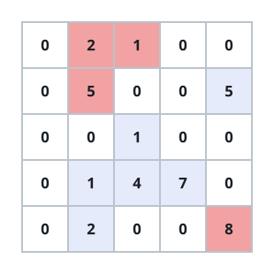
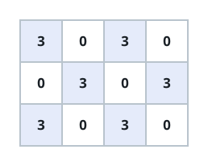

# Island Totals Divisible by K

## Description

A grid of `m` rows and `n` columns holds one non-negative integer per cell.
Every positive cell is land; zeros are water and join no island. Land cells
that touch horizontally or vertically belong to the same island, and an
island's total is the sum of the numbers written on its cells.

Given the grid and a positive integer `k`, count the islands whose total is
a multiple of `k`.

### Example 1



```text
Input: grid = [[0,2,1,0,0],[0,5,0,0,5],[0,0,1,0,0],[0,1,4,7,0],[0,2,0,0,8]], k = 5
Output: 2
Explanation: The grid splits into four islands. The two shaded blue in the
figure add up to multiples of 5; the two shaded red do not.
```

### Example 2



```text
Input: grid = [[3,0,3,0], [0,3,0,3], [3,0,3,0]], k = 3
Output: 6
Explanation: Every one of the six islands sums to a multiple of 3, so all
of them are counted.
```

### Constraints

- The grid has `m` rows and `n` columns, with `1 <= m, n <= 1000` and
  `1 <= m * n <= 10⁵`.
- `0 <= grid[i][j] <= 10⁶`
- `1 <= k <= 10⁶`

## Hints

### Hint 1

Walk the grid until you reach land you have not seen before, then flood
that whole island with a queue or stack while adding up its cell values as
you visit them.

### Hint 2

An island counts exactly when its accumulated total leaves remainder zero
modulo `k`.
