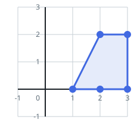

# Trapezoids Among the Points I

## Description

A set of points is scattered across the plane; `points[i] = [xi, yi]`
gives the coordinates of the i-th one.

Pick any four distinct points from the array. When those four can serve
as the corners of a convex quadrilateral that carries a pair of sides
running parallel to the x-axis, the pick forms a horizontal trapezoid.
(As usual, two segments are parallel exactly when their slopes are
equal.)

Count the distinct four-point picks that produce a horizontal trapezoid.
The true number grows quickly, so report it modulo `10⁹ + 7`.

### Example 1




```text
Input: points = [[1,0],[2,0],[3,0],[2,2],[3,2]]
Output: 3
Explanation: Three different picks of four points each build a
horizontal trapezoid:

    points [1,0], [2,0], [3,2], and [2,2].
    points [2,0], [3,0], [3,2], and [2,2].
    points [1,0], [3,0], [3,2], and [2,2].
```

### Example 2


```text
Input: points = [[0,0],[1,0],[0,1],[2,1]]
Output: 1
Explanation: Exactly one pick of four points works here.
```

### Constraints

- The array holds between `4` and `10⁵` points.
- Each coordinate satisfies `-10⁸ <= xi, yi <= 10⁸`.
- No two given points coincide.

## Hints

### Hint 1

Every point on one shared horizontal line carries the same y-coordinate,
so the horizontal lines of the figure are exactly the y-value groups of
the input.

### Hint 2

Bucket the points by y-coordinate and reduce each bucket to how many
pairs it can supply — with `c` points on a line, that is `c` choose 2.

### Hint 3

A trapezoid is one pair of points from each of two different buckets, so
sum the products of pair counts across all bucket pairs.
