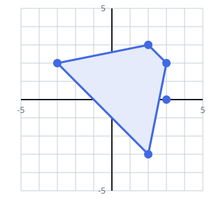

# Trapezoids Among the Points II

## Description

A set of points is scattered across the plane; `points[i] = [xi, yi]`
gives the coordinates of the i-th one.

Pick any four distinct points from the array. When those four can serve
as the corners of a convex quadrilateral that carries at least one pair
of parallel sides, the pick forms a trapezoid — the sides may run in any
direction this time, not just horizontally, and two segments count as
parallel exactly when their slopes are equal.

Count the distinct four-point picks that produce a trapezoid.

### Example 1




```text
Input: points = [[-3,2],[3,0],[2,3],[3,2],[2,-3]]
Output: 2
Explanation: Two different picks of four points each build a trapezoid:

- points [-3,2], [2,3], [3,2], [2,-3] form one.
- points [2,3], [3,2], [3,0], [2,-3] form another.
```

### Example 2


```text
Input: points = [[0,0],[1,0],[0,1],[2,1]]
Output: 1
Explanation: The four points admit exactly one trapezoid.
```

### Constraints

- The array holds between `4` and `500` points.
- Each coordinate satisfies `-1000 <= xi, yi <= 1000`.
- No two given points coincide.

## Hints

### Hint 1

File every segment between two points under its reduced slope `(dy, dx)`
— divide by the GCD and pin the sign down so `(1, 2)` and `(-1, -2)`
land in the same file.

### Hint 2

Inside one slope's file of `k` segments there are `C(k, 2)` ways to pick
the two that will serve as a trapezoid's parallel bases.

### Hint 3

Bases sharing an endpoint do not enclose anything, so those pairs have to
go.

### Hint 4

Parallelograms sneak in twice — once per parallel-side pair. Count them
separately through their diagonals, which meet at one shared midpoint,
and subtract one for each.

### Hint 5

The answer is the total of valid base-pairs with the parallelogram
overcount removed.
