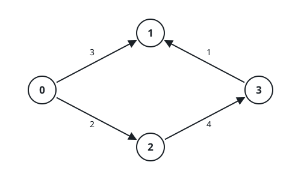

# Detours Through Reversed Lanes

## Description

A directed weighted graph holds `n` nodes labeled `0` through `n - 1`, and
`edges[i] = [uᵢ, vᵢ, wᵢ]` describes a one-way lane from node `uᵢ` to node
`vᵢ` costing `wᵢ` to walk.

Every node is fitted with a one-shot switch. On arriving at a node whose
switch is still unused, you may spend that switch on one of the node's
incoming lanes `x -> c`: the lane flips into `c -> x` and you walk it at
once for `2 * wᵢ`. The flip covers that single move only — the switch is
spent and never works again.

Travel from node `0` to node `n - 1` as cheaply as possible and return the
minimum total cost, or `-1` when node `n - 1` cannot be reached.

### Example 1



```text
Input: n = 4, edges = [[0,1,3],[3,1,1],[2,3,4],[0,2,2]]
Output: 5
Explanation: Walk the lane 0 -> 1 for 3. Node 1 still has its switch, and
the lane 3 -> 1 comes in there: flip it into 1 -> 3 and walk it right away
for 2 * 1 = 2. The trip totals 3 + 2 = 5.
```

### Example 2

```text
Input: n = 4, edges = [[0,1,2],[1,3,5],[3,1,1],[0,2,4],[2,3,3]]
Output: 4
Explanation: Go 0 -> 1 for 2, then flip node 1's incoming lane 3 -> 1 into
1 -> 3 and walk it for 2 * 1 = 2, a total of 4. Going 0 -> 2 -> 3 instead
would cost 4 + 3 = 7.
```

### Example 3

```text
Input: n = 3, edges = [[0,1,4],[1,2,6]]
Output: 10
Explanation: No flip pays off here: walk 0 -> 1 for 4 and then 1 -> 2 for
6. Reversing 0 -> 1 at node 1 would only head backward for a doubled toll.
```

### Example 4

```text
Input: n = 5, edges = [[0,1,1],[1,2,1],[2,3,1],[3,4,1]]
Output: 4
Explanation: A plain directed chain already leads from 0 to 4 at a cost of
1 + 1 + 1 + 1 = 4, and no switch is ever needed.
```

### Constraints

- `2 <= n <= 5 * 10⁴`
- `1 <= edges.length <= 10⁵`
- `edges[i].length = 3`
- `0 <= uᵢ, vᵢ <= n - 1`
- `1 <= wᵢ <= 1000`

## Hints

### Hint 1

Does any node ever need more than one reversal? If not, each incoming lane
can simply contribute one permanent reversed copy, and the shortest-path
search picks whichever copy helps.

### Hint 2

Augment the graph with `{v, u, 2 * w}` for every `{u, v, w}` and run
Dijkstra.
